.. -*- coding: utf-8 -*-

Manual de Usuario de Plone 4
============================

Un manual para administradores y creadores de contenido en Plone.

1. Introducción
===============

Un Resumen conceptual de Plone

1.1. Resumen conceptual
=======================

Una explicación de Plone como sistema de gestión de contenidos

¿Qué es Plone?
==============

Plone es un sistema de gestión de contenidos (del inglés, Content
Management System - CMS) que puede emplearse para construir un sitio
web. Empleando Plone, las personas sin conocimientos de programación o
sin la ayuda de un experto pueden contribuir al contenido de un sitio
web. Plone funciona vía web, por lo tanto no necesita instalar ningún
software especializado en la computadora del cliente. La palabra
*contenido* es usada en un sentido general ya que usted puede publicar
distintos tipos de información, incluyendo:

.. figure:: images/content_types_into_plone.png
   :align: center
   :alt: Tipos de contenidos dentro de Plone

Un sitio web Plone contiene diferentes tipos de contenido, incluyendo
textos, fotos e imágenes. Estos pueden ser almacenados en diferentes
formas: documentos, noticias, eventos, vídeos, archivos de audio y
cualquier tipo de archivo que pueda ser subido o creado en un sitio web.
El contenido también puede subirse desde una computadora local, además,
Plone le permite crear *carpetas* para organizar el contenido y crear
una estructura de navegación:

.. figure:: images/content_is_added_to_folders.png
   :align: center
   :alt: Contenido es agregado en carpetas

¡Usted adora las mariposas!
===========================

Si se deseara agregar contenido sobre mariposas, por ejemplo, se puede
crear una carpeta llamada "Mariposas" y luego agregar texto a una página
dentro de la carpeta:

.. figure:: images/butterflies_folder_text.png
   :align: center
   :alt: Texto de Carpeta Mariposas

También se pueden agregar algunas imágenes a la carpeta:

.. figure:: images/butterflies_folder.png
   :align: center
   :alt: Carpeta Mariposas

Dentro de una carpeta usted puede agregar muchos contenidos de distintos
tipos, incluyendo sub-carpetas. Luego de agregar algunos reportes y
vídeos a la carpeta Mariposas, el contenido debería estar organizado
como se muestra a continuación, con dos sub-carpetas dentro de la
carpeta Mariposas:

.. figure:: images/folders_within_folders.png
   :align: center
   :alt: Carpeta en carpeta

¿Qué ocurre tras bambalinas?
============================

Es probable que el lector se pregunte cómo funciona todo. Un sitio Web
Plone típico existe como una instalación de Plone instalada en un
servidor web. El servidor web puede estar en cualquier sitio, usualmente
en una compañía de hospedaje con una "pila" de computadoras dedicadas a
realizar la tarea:

.. figure:: images/server_rack.png
   :align: center
   :alt: Rack del servidor

El diagrama muestra los cables que conectan los servidores individuales
a internet, a través de rápidas conexiones de red. Su sitio Plone es
solo un software y almacenamiento de base de datos instalados en uno de
los servidores individuales. Cuando introduce texto o hace clic, la
computadora del usuario envía y recibe datos a través de cables de red y
canales de comunicación en internet que interactúan con la instalación
de Plone en el servidor.

Simplifiquemos el diagrama que muestra cómo se interactúa con Plone:

.. figure:: images/client_to_server_simple.png
   :align: center
   :alt: Del cliente al servidor

Usted usa su navegador web; Mozilla Firefox, Safari, Internet Explorer,
etc. -- para ver y editar su sitio web Plone, y este guarda los cambios
realizados en su sistema de almacenamiento de bases de datos.

Por ejemplo, imagine que su sitio web Plone de Mariposas está ubicado en
el sitio misitio.com. Usted escribe www.misitio.com en su navegador web.
Luego presiona la tecla Enter, y la siguiente secuencia de eventos es
llevada a cabo entre el navegador y el servidor de www.misitio.com:

.. figure:: images/client_request.png
   :align: center
   :alt: Solicitud del cliente

Luego el software Plone responde:

.. figure:: images/server_response.png
   :align: center
   :alt: Respuesta del servidor

Plone lee su respectiva base de datos para buscar la información
almacenada en misitio.com. Luego envía de vuelta la página web a su
computadora en un código llamado HTML que es un lenguaje de computadora
que describe con luce una página web. Este incluye texto, gráficos,
tipos de letras, color del fondo, etc. En Internet existen muchos sitios
donde se puede aprender HTML detalladamente, pero una de las ventajas de
Plone es que no es necesario aprender (demasiado) sobre HTML. Esa es una
de las razones por la que Plone y otros software similares permiten al
usuario concentrarse en el contenido, por ejemplo, el texto y los
gráficos de las mariposas en vez de aprender un nuevo lenguaje de
computadoras.

Pero regresemos a la interacción entre la computadora del usuario y el
servidor. El navegador web "suministra" (traduce) este HTML para que
pueda ver la página web resultante:

.. figure:: images/my_site_served.png
   :align: center
   :alt: Mi sitio servido

Así que cuando ve su página web de mariposas, puede decidir si cambiarla
o agregarle contenido. Además en cualquier momento se puede subir fotos,
documentos, etc:

.. figure:: images/plone_donut.png
   :align: center
   :alt: 

Luego que hace sus cambios y hace clic en "Guardar", la nueva versión de
la página web se mostrará a cualquiera que visite el sitio:

.. figure:: images/plone_donut_full.png
   :align: center
   :alt: 

1.2. Diseño visual de los sitios web Plone
==========================================

Plone permite a diseñadores y administradores crear diseños únicos para
sus sitios. En esta sección se hace un breve recorrido por el esquema de
Plone y algunos ejemplos de diseño.

¿Cómo luce un sitio web hecho con Plone?. Desde hace varios años existe
un diseño consistente para la apariencia por defecto de Plone. El diseño
por defecto generalmente se parece a lo siguiente:

.. figure:: images/plone-default-design-areas.png
   :align: center
   :alt: 

Aunque un sitio Plone puede tener un diseño radicalmente distinto a
este, igual debería identificar los elementos comunes, como por ejemplo
el enlace de entrar, un panel de navegación o un menú. En el diseño por
defecto, el menú de navegación está a la izquierda y usualmente muestra
una lista de carpetas. También puede haber un grupo de pestañas *Entrar,
información sobre la ubicación* en la franja de la parte superior.

Es posible distinguir entre el *diseño* de un sitio web y su
*funcionalidad*. Para realmente realizar el trabajo, concéntrese en la
funcionalidad y no se preocupe demasiado por la apariencia y diseño del
sitio web. Una fortaleza del sistema de contenidos de Plone, es que un
sitio web puede ser radicalmente rediseñado sin afectar al contenido ni
funcionalidad. El menú de navegación puede moverse de izquierda a
derecha y funcionará del mismo modo. El área de la derecha puede
eliminarse ya que normalmente la funcionalidad que se le da a esta no es
necesaria. Las áreas de la izquierda, principal, y derecha, tal como se
describe arriba y abajo, pueden cambiarse a la parte superior, media, e
inferior, y aún así debajo de todo esto seguiría siendo un sitio web
Plone.

Usaremos el diseño por defecto de Plone como ejemplo de una división
típica de pantalla:

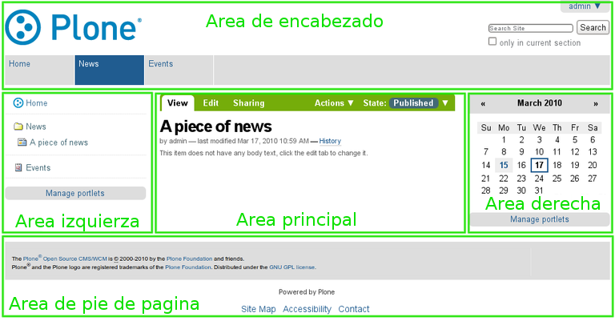

Usted tal ves requiera adaptar estos términos (áreas) según sea
necesario para el diseño de su sitio web Plone. Seguramente se usarán
términos (áreas) variados para describir el diseño real del sitio, como
por ejemplo, los "slots" o paneles izquierdo y derecho para las columnas
laterales. Los "portlets" o "viewlets" para las áreas discretas o
"cajas", entre otros.

A modo de ejemplo, se seleccionará tres sitios para comparar tomados de
la `lista de sitios web Plone <http://plone.net/sites>`_:

.. figure:: images/akamaidesign.png
   :align: center
   :alt: sitio web de Akamai

En la figura, se muestra el sitio de Akamai, un líder proveedor de
herramientas y tecnologías de aceleración web. El encabezado posee un
simple menú con enlaces que lista horizontalmente a las cinco secciones
principales de contenido. A la derecha, el encabezado posee otro menú
horizontal y un cuadro de búsqueda. Al pie del encabezado se muestra la
opción para entrar al sitio, opción empleada por los responsables del
mismo. Debajo del encabezado y a la izquierda, hay un área para gráficos
llamativos y temas actuales. El área principal en el centro a la
izquierda se encuentra el texto principal. La columna derecha contiene
una serie de "portlets." El pie de página posee un menú horizontal con
las mismas opciones del encabezado convenientemente. Por último, a la
derecha hay una columna con opciones de zoom.

.. figure:: images/discoverdesign.png
   :align: center
   :alt: sitio web de Discover Magazine

Este es el sitio web de Discover Magazine. El área de encabezado
contiene un extenso menú horizontal o si se quiere "menú principal," en
la esquina superior derecha hay otro menú y un cuadro de búsqueda. Este
sitio posee un gran número de "portlets" de texto que cubren diferentes
temas, los cuales están agrupados en tres columnas, izquierda, centro y
derecha. En la parte superior de la columna del centro hay un área con
un vídeo. Y en diferentes partes del sitio abundan cuadros interactivos.
El pie de página contiene información básica sobre la identificación y
un enlace a "acerca de". En sitios complejos como lo es la revista
Discover, los responsables de contenido entran mediante pantallas de
edición personalizadas y hay una gran automatización de flujos de datos
- Plone está construido sobre Zope, un sistema sofisticado de
almacenamiento, y Python un excelente lenguaje de programación que
facilita mucho el "cableado" inteligente de flujo de texto y gráficos en
el sitio web.

.. figure:: images/smealdesign.png
   :align: center
   :alt: sitio web de la Penn State University's Smeal College of Business

El último ejemplo para examinar de los tres sitios web es el de Penn
State University's Smeal College of Business (Escuela de Negocios Smeal
de la Universidad Estatal de Pensilvania) El encabezado contiene un
logotipo, un menú horizontal para las áreas principales y un cuadro de
búsqueda a la derecha. El sitio posee un menú principal a la izquierda,
el cual es uno de los elementos más tradicionales en sitios web Plone.
Una área grande que contiene una animación móvil. Y otro gráfico pequeño
en la columna izquierda. Hay tres columnas textuales que completan el
diseño arriba del pie de página de identificación. Los responsables de
este sitio web acceden a través de una página de inicio de sesión
personalizada, con la sesión y información del usuario mostrados en la
parte inferior del área de encabezado superior.

Para concluir, ¿cómo luce un sitio web hecho en Plone?,
Tradicionalmente, recién instalado luce como se mostró en las primeras
figuras de esta página, con encabezado, menú, columnas y pie de página.
Los tres sitios mostrados, son ejemplos de como los diseñadores pueden
combinar distintas áreas, menús horizontales y verticales, "portlets",
contenido textual, ubicados generalmente en una serie de columnas. La
maquinaria base es Plone, sobre Zope y Python, pero el diseño llamado
"tema" o "skin" puede modificarse para que luzca en la forma que quiera
el diseñador.

1.3. Cuentas y roles de usuarios en Plone
=========================================

Los elementos básicos al usar una cuenta de un sitio web Plone,
distinción entre un usuario anónimo y registrado y la descripción de los
roles de usuario.

Los sitios construidos sobre Plone son muy diversos: sitios personales,
sitios de comunidades, organizaciones o negocios con cientos de usuario.
Cada persona que agrega contenido a un sitio Plone debe tener su propia
cuenta de usuario. Una cuenta de usuario está compuesta de un nombre de
usuario y una contraseña. Algunos sitios Plone permiten que sus
visitantes creen sus propias cuentas mediante el enlace **Registrar** y
un formulario que requiere información de usuario elemental. Otros
sitios poseen cuentas que son creadas por administradores, en cuyo caso
las personas suelen recibir mensajes de correo electrónico con los
detalles de la cuenta de usuario.

Una vez creada la cuenta de usuario Plone, esta le permite a una persona
acceder al área de administración de contenido ingresando su nombre y
contraseña. Las contraseñas son sensibles a mayúsculas y minúsculas.
Esto significa que hay que prestar atención al momento de escribir la
contraseña porque no es lo mismo escribir una letra en mayúscula o
minúscula. Por ejemplo, si la contraseña es xcFGt6v hay que escribirla
exactamente de ese modo, caso contrario no se podrá lograr el acceso. En
general se recomienda emplear contraseñas que tengan distintos
caracteres sobre contraseñas como "raccoon" o "boardwalk" porque son más
complejas de descubrir y por lo tanto son más seguras.

Navegación de usuario registrado versus usuario anónimo 
-------------------------------------------------------

La distinción entre *la navegación de usuarios anónimos* y la *actividad
web autenticada (registrado)* es muy importante: 

Navegación de usuario anónimo
~~~~~~~~~~~~~~~~~~~~~~~~~~~~~

Esta es la manera normal en que una persona navega la web. Usted
escribe la dirección del sitio en el navegador y observa las páginas
web, ve vídeos e imágenes y no requiere iniciar sesión.. Por este motivo
es llamado anónimo: cualquier persona puede navegar el sitio sin dar a
conocer su identidad. Note la presencia del enlace *Entrar (Log in)* en
la parte superior derecha de la siguiente figura. Si un sitio Plone
muestra el enlace *Entrar (Log in)*, esto significa que el usuario no ha
iniciado sesión, y el usuario está navegando de forma anónima, como se
muestra en la siguiente figura de un sitio Plone nuevo:

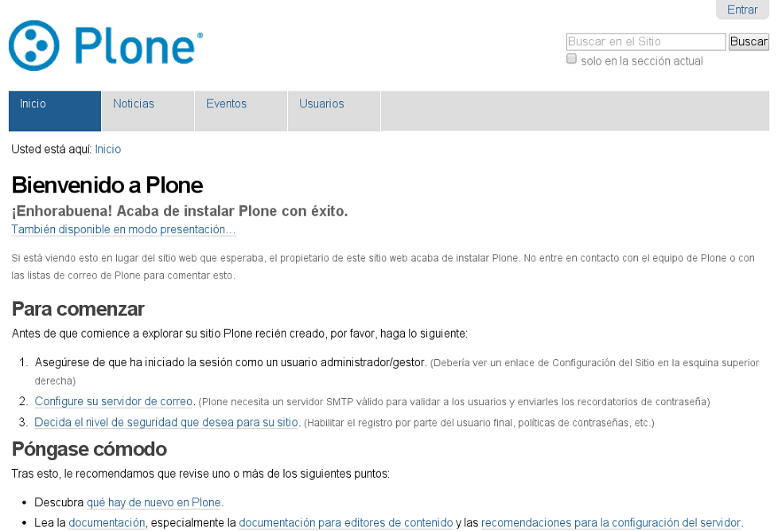

Actividad web autenticada (registrado)
~~~~~~~~~~~~~~~~~~~~~~~~~~~~~~~~~~~~~~

Usted puede estar familiarizado con el modo *autenticado*, por
ejemplo, es el que emplea el sitio web de un banco, tarjeta de crédito,
o cualquier otro sitio web que requiere una cuenta de usuario. El sitio
web de un banco permite ver información sobre su cuenta, llenar
formularios, transferir fondos y otras acciones, siempre y cuando haya
iniciado sesión. Un sitio Plone no es muy diferente, con la diferencia
que se pueden hacer cosas mas sofisticadas. Observe la siguiente imagen,
el usuario "John Smith" ha iniciado su sesión. Cerca de la parte
superior derecha usted puede ver enlaces para el nombre John Smith y
salir de la sesión. Otra diferencia importante posterior al inicio de
sesión -- sobre el cuerpo principal ahora aparece un encabezado verde
con pestañas. Estas pestañas aparecen cuando un usuario tiene
suficientes privilegios para modificar un área del sitio web. John Smith
tiene los permisos para cambiar esta área principal. Las pestañas en el
encabezado verde para el área principal variarán un poco, pero usted
puede contar con que se parece a una interfaz con pestañas de este color
verde particular. En la siguiente figura, el usuario John Smith ha
iniciado sesión dentro de un nuevo sitio web Plone:

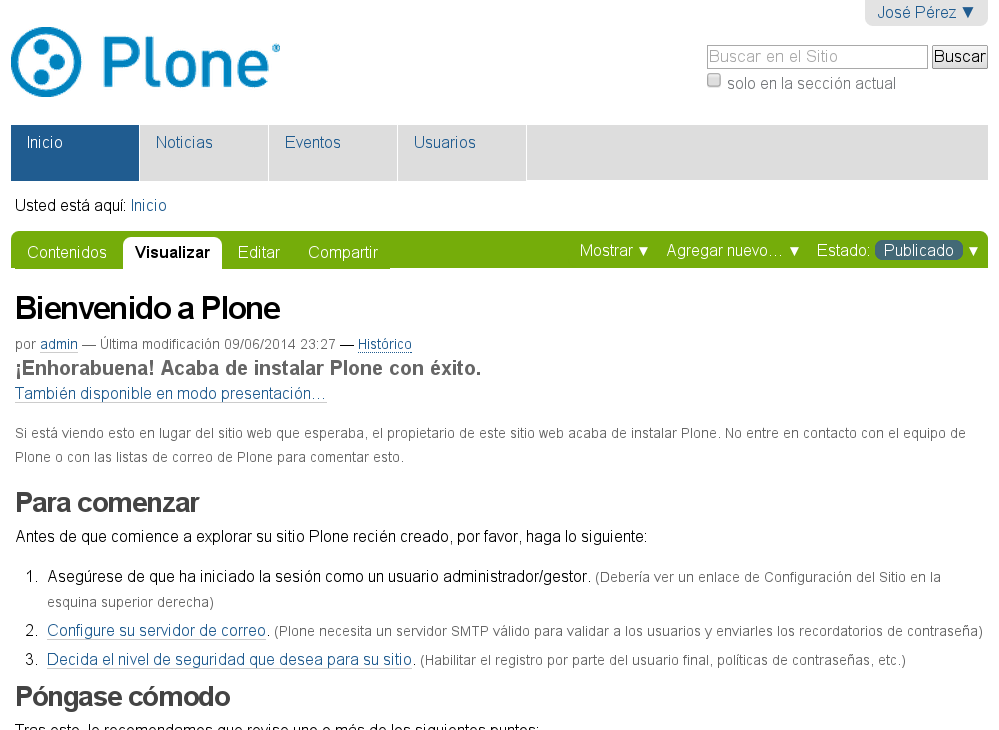

Roles de usuario
----------------

La distinción entre los diferentes roles de usuarios es muy importante
en un sitio web Plone. Para ilustrar el caso más simple, considere los
dos roles de usuarios, uno llamado *miembro* y otro llamado
*administrador*. Estos roles tienen diferentes privilegios o "poderes":

Miembro
~~~~~~~

-  posee una cuenta de usuario y por ello puede iniciar sesión
-  puede agregar contenido, pero solamente en áreas especificas y no
   puede cambiar nada fuera de estas. A menudo a los usuarios se les
   otorga un "área base", para ser tratada como espacio personal donde
   pueden agregar contenido.
-  no pueden publicar contenido, lo que significa que no es visible a
   visitantes anónimos, incluso el mismo contenido que ellos agregaron.
   Una persona con el rol de Administrador debe aprobar el contenido
   para que sea publicado.

Administrador
~~~~~~~~~~~~~

-  posee una cuenta de usuario y por ello puede iniciar sesión
-  puede agregar contenido en cualquier parte del sitio y tiene
   privilegios para cambiar cualquier cosa
-  puede publicar cualquier contenido

Cuando usted obtiene una cuenta nueva en un sitio web Plone, se le
debería dar información de las áreas donde tiene privilegios para
agregar contenido una vez haya iniciado sesión. Si esto ocurre y el
usuario abre la carpeta donde tiene tales privilegios, en la parte
superior del contenido se deben visualizar pestañas de color verde con
los nombres *Contenidos*, *Visualizar*, *Editar*, Reglas\ **, y
*compartir*:

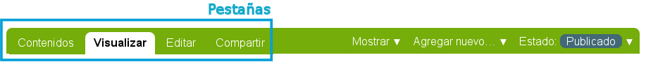

Si se hace clic en ellas es posible explorar las diferencias entre una y
otra, de todas maneras aquí están las descripciones para ayudarlo a
empezar:

-  *Contenidos* - muestra una lista con los elementos que contenidos en
   la carpeta
-  *Visualizar* - muestra la vista que un usuario anónimo visualizará
-  *Editar* - cambia el panel a una vista de edición
-  *Reglas* - muestra un panel para controlar cómo son creados y
   administrados los elementos
-  *Compartir* - muestra un panel para establecer permisos para que
   otros usuarios puedan ver y editar el contenido

Debajo de las pestañas en la parte baja del encabezado verde puede ver
varios menús *Mostrar, Agregar nuevo y Estado*:

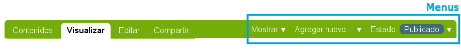

Explore estos también. Aquí están las descripciones básicas de estos
menús:

-  *Mostrar* - permite seleccionar el tipo de vista (lista de elementos,
   vista de resumen, etc.)
-  *Agregar nuevo...* - muestra un menú con los diferentes elementos de
   contenidos que se pueden agregar (imágenes, páginas, carpetas, etc.)
-  *Estado* - permite cambiar el estado de publicación del elemento
   actual (privado, borrador público, público, etc.)

Estos menús y pestañas son los medios principales para interactuar con
Plone. A medida que usted aprenda más sobre administrar un sitio web
Plone, más familiar le resultarán los procesos.

1.4. Iniciar sesión
===================

¿Qué esperar cuando usted inicia sesión en un sitio Plone?

Cuando usted visita un sitio web Plone de forma anónima o se le ha dado
la dirección web para mantenimiento del sitio, aparecerá un botón
*Entrar* en la esquina superior derecha similar a este:

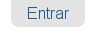

Luego de hacer clic en el botón *Entrar*, verá un panel donde debe
escribir el login name (nombre de usuario) y el password (contraseña):

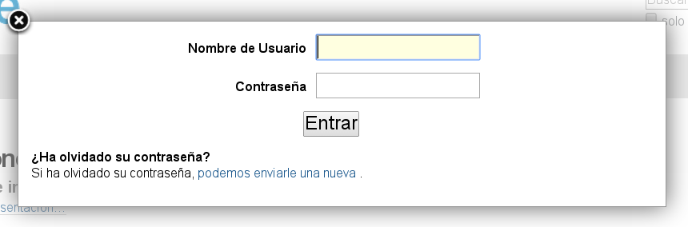

Luego de iniciar sesión en un sitio web Plone podrá ver la indicación de
su nombre, usualmente en la esquina superior derecha de la pantalla.
Usted puede hacer clic en su nombre para ejecutar algunas acciones
relacionadas a su cuenta de usuario, mostrado en la siguiente sección.

De Plone 4 en adelante, usted (o el administrador del sitio) pueden
permitir a los usuarios usar sus direcciones de correo electrónico como
nombre de inicio de sesión. Esta característica puede ser activada en el
panel de control de opciones de Seguridad. Y tiene como consecuencia que
en el formulario de registro ningún campo para el nombre de usuario sea
mostrado. En la sección para iniciar sesión se le pedirá que introduzca
la dirección de correo electrónico. Para más información sobre esta
característica vea `E-mail address based login in the Upgrade Guid`_

.. _E-mail address based login in the Upgrade Guid: http://plone.org/documentation/manual/upgrade-guide/version/upgrading-plone-3-x-to-4.0/e-mail-address-based-login

1.5. Configurando sus preferencias de usuario
=============================================

Luego de iniciar sesión en el sitio web Plone, usted puede cambiar sus
preferencias personales por información sobre su identidad y elegir las
configuraciones del sitio web.

Luego de iniciar sesión, su nombre completo será colocado en la esquina
derecha del encabezado. Haga clic en su nombre para abrir el menú
desplegable, luego haga clic en la opción *cuadro de mandos* para ir a
su área personal.

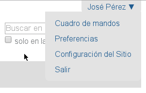

Podrá ver su panel dashboard (cuadro de mandos)\ **:

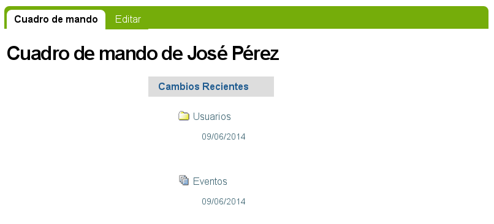

Cuando usted inicia sesión por primera vez, su cuadro de mando estará
vacío, como lo indica el mensaje. Los Portlets son "vistas" específicas
de diferentes tipos de contenidos. Usted puede elegir cuales Portlets
quiere en su cuadro de mando, haciendo clic en la pestaña *Edit* pero en
un segundo llegaremos allí. 

Primero veamos la opción *Preferencias* del menú desplegable previo, la
cual mostrará el panel de edición de preferencias personales.

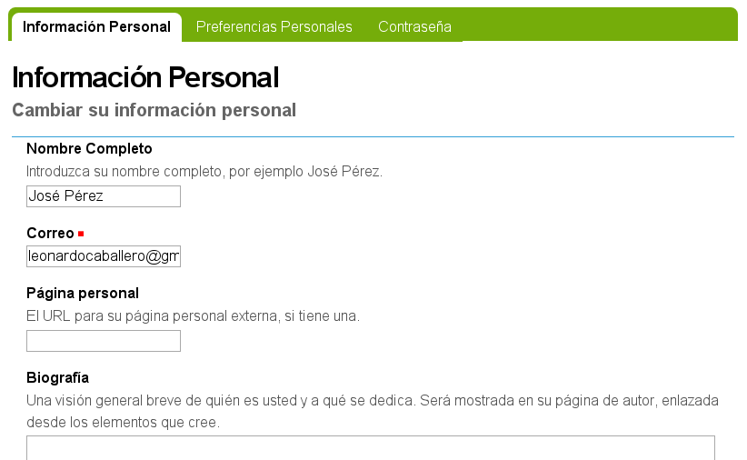

Los campos de entrada incluyen:

-  *Nombre Completo*- Si su nombre es común, incluya la primera inicial
   o segundo nombre completo.

-  *Correo* - REQUERIDO - Usted podrá recibir correos electrónicos del
   sistema del sitio web, o de una tabla de mensajes si se encuentra
   instalada, entre otros. Cuando un elemento es obligatorio, un pequeño
   cuadrado rojo será mostrado al lado del elemento.

-  Caja de texto de *Localización*\ **- Este es el nombre de su ciudad,
   pueblo, estado, provincia o de donde sea que provenga\ *.*

-  Menú de selección para *preferencias del idioma* - Plone sobresale al
   ofrecer soporte multilingüe.

-  Caja de texto de *Biografía* - Introduzca una corta descripción de
   usted mismo. Aproximadamente de un párrafo de largo.

-  Dirección de la *Página personal* - Si usted tiene su propio sitio
   web o un área para compartir fotos en un sitio web, en este caso,
   introduzca la dirección del sitio web aquí si así lo desea, para que
   la gente pueda saber más sobre usted.

-  Menú de selección para *Editor de Contenido* - Usted tiene la opción
   de usar TinyMCE o Kupu, los cuales le permiten editar páginas web con
   una linda interfaz gráfica o usando un panel de edición, lo cual es
   bueno si usted esta acostumbrado a escribir páginas web usando HTML
   (El "código" básico de las paginas web). La configuración por defecto
   para sitios nuevos usa TinyMCE el cual es asumido en este manual de
   usuario.

-  Casilla de comprobación que *Permite edición externa* - Este es el
   encendido y apagado de un editor "externo", si alguno ha sido
   instalado por el administrador del sito web. El uso de un editor
   "externo" es principalmente para diseñadores web y programadores
   quienes, logran realizar más editando el código mismo, pero estos
   pueden ser usados para la creación de páginas web en gran volumen
   usando lenguajes de marcado especializados. (No se preocupe por esto,
   si no ha escuchado nada de su administrador del sitio).
-  *Foto* del avatar - La fotografía aparecerá como una pequeña imagen o
   imagen de tamaño miniatura, así que es mejor usar una imagen de su
   rostro o una por encima del torso.

Usted puede cambiar sus preferencias cuando lo desee.

1.6. Su cuadro de mandos
========================

Un usuario de Plone tiene un "cuadro de mandos" personal a través del
cual personaliza su interfaz de usuario.

Plone tiene algunas "vistas" de noticias, eventos, cambios en elementos
recientes y más. Estas vistas están en zonas rectangulares separadas
llamadas Portlets. Piense en un Porlet como la vista de una ventana de
un tipo específico de contenido. Por ejemplo, el Portlet de noticias
ofrece vistas de elementos de noticias recientemente publicados.

Usted controla que Porlets ve en su cuadro de mandos, y donde están
colocados. La siguiente captura de pantalla muestra lo que el usuario
Elizabeth Smith podrá ver luego de iniciar sesión y hacer clic en su
nombre en la parte superior derecha para ir a su área personal:

.. figure:: images/dashboard.png
   :align: center
   :alt: 

El cuadro de mandos aparece vacío para nuevos usuarios.

Al Hacer clic en la pestaña de editar del cuadro de control, se
mostrarán los Porlets que ya han sido asignados.. El cuadro de mandos de
arriba esta vacío, porque aquí no hay contenido disponible para mostrar
en los Portlets de este nuevo sitio web. Aquí están los Portlets por
defecto:

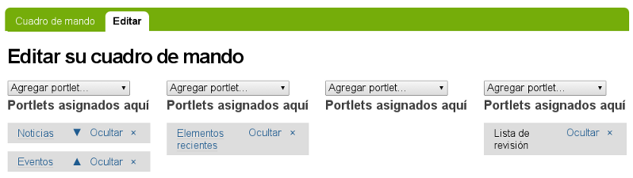

Usted ve los Portlets de *Noticias* y *Eventos* en la columna totalmente
a la izquierda, los Portlets de *Elementos recientes* en la segunda
columna, y el portlet de la *lista de revisiones* en la columna derecha.
La tercera columna no tiene un Portlet asignado.

Una nueva cuenta de usuario en un sitio web Plone básico puede tener un
cuadro de mando como el mostrado, pero para un sitio web que ha sido
personalizado con funcionalidades de agregados, pueden haber más
Portlets para elegir, y el cuadro de mando podrá iniciar con más
listados en las columnas.. Por ejemplo, podrían haber Portlets para
"clima actual", "acciones", "cita del día", entre otras, dependiendo de
que está instalado en el sitio (estos elementos requieren de un software
personalizado). Dependiendo de que está instalado en el sitio, el
usuario puede personalizar lo que quiera ver en los portlets y la
ubicación de estos en las cuatro columnas.

Entonces, para los usuarios típicos de Plone el cuadro de mando podría
iniciar con los Portlets mostrados anteriormente y luego serían
"poblados" de noticias, eventos, u otros elementos añadidos al sitio
web.

2. Agregando Contenido
======================

¿Cómo agregar tipos de contenidos básicos a sitios web Plone?

2.1. Agregando Nuevo Contenido
==============================

Una descripción general de como agregar nuevos elementos de contenidos
en Plone, incluyendo definiciones de cada tipo de contenido estándar.

Los nuevos contenidos son agregados vía el menú desplegable **Agregar
nuevo .** :

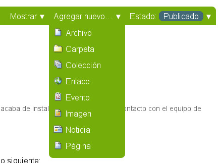

   add-new-menu.png

Agregar contenido en Plone se hace de manera *agradable*, lo que quiere
decir que usted debe navegar a la sección de su sitio web Plone en donde
quiere que el nuevo contenido resida antes de usar el menú desplegable
**Agregar nuevo .** . Por supuesto usted puede cortar, copiar y pegar
elementos de contenido desde una sección a otra si es necesario.

 

Tipos de Contenido
------------------

En Plone, usted puede usar un número de **Tipos de Contenido** para
publicar ciertos tipos de contenido. Por ejemplo, para subir una imagen
usted puede usar el tipo de contenido **Imagen**. La siguiente es una
lista de tipos de contenidos disponibles en el orden de su aparición, y
para que se usa cada uno:

Colección
    Las Colecciones son usadas para agrupar y mostrar contenido basado
    en una serie de **criterios** los cuales puede definir. Estas
    trabajan como una consulta a una base de datos.
Evento
    Un evento es un tipo de contenido como una página especial para
    publicar información acerca de un evento (como una recaudación de
    fondos, parrillada, etc). Este tipo de contenido tiene una función
    que le permite al visitante del sitio agregar el evento a su
    calendario de escritorio con el estándar iCal o vCal. Este formato
    es soportado por aplicaciones como: Google Calendar, Outlook,
    Sunbird y otros.
     Para agregar un evento a su calendario, haga clic en el enlace vCal
    o iCal al lado del texto "Agregar evento al calendario" en la vista
    principal de un elemento de evento.

    .. image:: images/image_preview_002.jpeg

    Desde Plone 3.3 usted puede obtener también todos los eventos en
    una carpeta en un solo paso (actualmente solo disponible en formato
    iCal). Para descargar el archivo iCal, agregue *@@ics\_view* al
    final de la dirección URL de la carpeta que contiene los eventos.
    Por ejemplo, si usted quiere obtener todos los eventos dentro de la
    carpeta *Eventos* en el raíz de su sitio, vaya a
    *http://misitio.com/events/@@ics\_view*. Hay maneras para proveer un
    enlace a este calendario iCal dentro de la Interfaz de usuario en
    futuras publicaciones.

Archivo
    Un archivo en Plone es cualquier archivo binario que usted desee
    subir con la intención de que este sea descargado por los visitantes
    de su sitio. Ejemplos comunes son archivos PDF, Documentos de
    ofimática como MS Word y Hojas de Calculo.
Carpeta
    La carpetas trabajan en Plone muy parecido a como lo hacen las
    carpetas en su computadora. Usted puede usar carpetas para organizar
    su contenido, y dar a su sitio web Plone una estructura de
    navegación.
Imagen
    El tipo de contenido Imagen es usado para subir archivos de imagen
    (JPG, GIF, PNG) que usted puede insertarlas dentro de páginas u
    otros tipos de contenidos de tipo página.
Enlace
    También asociado como el 'Objeto enlace'; no confundirlos con los
    enlaces que usted crea vía TinyMCE o Kupu, editores visuales de
    páginas Plone. El tipo de contenido Enlace es regularmente usado
    para incluir un enlace a un sitio web externo en la navegación y
    otros usos especializados.
Noticia
    Este tipo de contenido es similar al Evento, solamente que estos
    elementos son especialmente para publicar noticias. Usted puede
    también adjuntar una imagen miniatura a una Noticia, la cual
    aparecerá en la vista de resumen en la carpeta al lado del resumen
    de la Noticia.
Página
    Una Página en Plone es uno de los contenidos disponibles más
    simples. Úselas para escribir la mayor parte de sus páginas web en
    el sitio Web Plone.

Nota: Dependiendo de que productos adicionales tenga usted instalado,
tendrá más opciones en su menú desplegable **Agregar nuevo . .** de las
que aparecen aquí. Para más información acerca de esos tipos de
contenidos adicionales, consulte la documentación del Producto adicional
a utilizar.

Título
~~~~~~

Todos los tipos de contenidos en Plone tiene dos campos en común:
**Título** y **Descripción.**

El **Título** de los elementos de contenido, incluyendo carpetas,
imágenes, páginas, etc., puede ser cualquier cosa que usted quiera --
puede usar cualquier carácter del teclado, incluyendo espacios. Los
**Títulos** son parte de la dirección web para cada elemento creado en
Plone. La dirección web, también conocida como URL, son las escritas en
el navegador web para ir a una ubicación específica en un sitio web (o
navegando a través del sitio), como:

www.mysite.com/about/personnel/sally/bio

o

www.mysite.com/images/butterflies/skippers/long-tailed-skippers

Las direcciones web *sí* tienen restricciones sobre los caracteres del
teclado permitidos, y los espacios no son permitidos. Plone hace el buen
trabajo de mantener las direcciones web correctas mediante el uso de
direcciones muy similares al **Título** que usted eligió,
convirtiéndolas a minúsculas, y sustituyendo guiones por espacios y
otras puntuaciones. 

En Plone nos referimos a la dirección web de un elemento como **nombre
corto**. Cuando usted use la función **Renombrar**, usted puede ver el
nombre corto junto con el título.

Los campos variarán en relación al tipo de contenido. Por ejemplo, el
tipo de contenido Enlace tiene el campo de dirección URL. El tipo de
contenido Archivo tiene el campo de Archivo, así continua con todos los
campos.

 

Descripción
~~~~~~~~~~~

La **Descripción** aparece al tope de las páginas, justo abajo del
Título. Las descripciones regularmente son usadas en conjunción con una
variante de vistas de Carpeta y Colección (como un Estándar o Resumen).
La Descripción también aparece en los resultados de búsquedas vía el
motor de búsqueda nativa de Plone.

 

2.2. Agregando Carpetas
=======================

Agregar carpetas a un sitio web Plone es la forma básica de controlar la
organización del contenido.

Sin duda usted ha creado carpetas (directorios) guardadas en el disco
duro de su computadora. Las computadoras personales usan una jerarquía
de carpetas para organizar y estructurar los archivos y programas en el
disco duro. Las carpetas de Plone son esencialmente idénticas, excepto
que son creadas en un sitio web Plone para organizar contenido en el
sistema de almacenamiento que trae Plone.

Las carpetas son agregadas haciendo clic en el menú **Agregar nuevo**
(usted necesita haber iniciado sesión para ver el menú **Agregar
nuevo**). Seleccione **Carpeta** desde el menú desplegable:

.. figure:: images/add-item-menu-folder.jpeg
   :align: center
   :alt: add-item-menu-folder.png

   add-item-menu-folder.png
Después de hacer clic para agregar una Carpeta usted verá el panel
*Agregar Carpeta*:

.. figure:: images/addfolder.jpeg
   :align: center
   :alt: 

Rellene el **Título**, que es requerido como lo indica el cuadrado rojo.
La **Descripción** es opcional; usted siempre puede volver al panel de
edición si necesita agregar una descripción para la carpeta. Las
descripciones son útiles cuando un visitante del sitio usa la
herramienta de búsqueda incluida con Plone - los resultados contendrán
ambos, el Título y la Descripción del elemento.

Usted notará también pestañas en la parte superior: *
*

-  *Predeterminado*, para ingresar los campos Título y Descripción, *
   *
-  *Categorización,* para especificar las categorías que se aplican a la
   carpeta (tal vez las conozca como *palabras claves*), *
   *
-  *Fechas*, para configurar el período de tiempo durante el cual la
   carpeta debería estar disponible para ser vista en el sitio web, *
   *
-  *Propietario*, para especificar el creador y/o contribuidores al
   elemento de contenido,
-  *Configuración,* para permitir comentarios acerca del elemento y si
   este se muestra en el menú de navegación del sitio web.

Estas pestañas son estándar, por lo tanto las verá cuando haga clic en
otros tipos de contenido. Estas pestañas serán analizadas en otra
sección de este manual de usuario.

Asegúrese de hacer clic en el botón **Guardar** al final de la página
cuando haya terminado. Esto completará el proceso de creación de una
carpeta.

----

.. figure:: images/lights-camera-action.png
    :alt: lights-camera-action.png
    :align: center

Vea un vídeo sobre cómo `agregar una carpeta`_ en Plone 2 y `agregar una carpeta en Plone 4`_.

----

.. figure:: images/additemmenufolder.html
   :align: center
   :alt: 

2.3. ¿Qué hay en un nombre web?
===============================

Los elementos individuales de contenido en un sitio web Plone tienen
direcciones web distintas. Plone crea estas automáticamente basándose en
el título que usted elija.

¿Qué hay en un nombre web?
--------------------------

El **Título** de los elementos de contenido, incluyendo carpetas,
imágenes, páginas, etc., puede ser cualquier cosa que usted quiera --
puede usar cualquier carácter del teclado, incluyendo espacios. Los
**Títulos** se vuelven parte de la dirección web de cada elemento que
usted crea en Plone. Las direcciones web, también conocidas como URL,
son las que usted escribe en un navegador web para ir a una posición
específica en un sitio web (o navegando a través del sitio), como:

www.mysite.com/about/personnel/sally/bio

o

www.mysite.com/images/butterflies/skippers/long-tailed-skippers

Las direcciones web *sí* tienen restricciones sobre los caracteres del
teclado permitidos, y los espacios no son permitidos. Plone hace el buen
trabajo de mantener las direcciones web correctas mediante el uso de
direcciones muy similares al **Título** que usted eligió,
convirtiéndolas a minúsculas, y sustituyendo guiones por espacios y
otras puntuaciones. 

Para ilustrar tomemos cada una de estas direcciones web y divida cada
una en las partes que las componen:

::

    www.mysite.com/about/personnel/sally/bio
    ^ 
    website name
                   ^ 
                   una carpeta llamada Acerca
                         ^ 
                         una carpeta llamada Personal
                                   ^ 
                                   una carpeta llamada Sally
                                         ^ 
                                         una carpeta llamada Bio

En este ejemplo Plone cambió cada título de carpeta a minúscula, por
ejemplo, de Personal a personal. Usted no tiene que preocuparse por
esto. Plone se encarga de las direcciones web; usted sólo escribe los
títulos de la forma que quiera.

Y, para el segundo ejemplo:

::

    www.mysite.com/images/butterflies/skippers/long-tailed-skippers
    ^
    website name
                   ^
                   una carpeta llamada Imágenes
                          ^
                          una carpeta llamada Mariposas
                                      ^
                                      una carpeta llamada Skippers
                                               ^
                                               una carpeta llamada Long-Tailed Skippers

Este ejemplo es similar al primero, ilustrando una conversión a
minúscula del título de cada carpeta a la parte correspondiente de la
dirección web. Note el caso de la carpeta llamada Long-tailed Skippers.
Plone mantiene el guión, ya que este es permitido en el título y como
parte de la dirección web, pero cambió el espacio entre las palabras
Tailed y Skippers por un guión en la dirección web, así como también
conversión a minúsculas.

En Plone nos referimos a la dirección web de un elemento como **nombre
corto**. Cuando usted use la función **Renombrar**, usted puede ver el
nombre corto junto con el título.
 

2.4. Agregando imágenes
=======================

Agregar imágenes a un sitio web Plone es una tarea básica que puede
involucrar un poco de trabajo en su computadora local, pero es esencial
porque las fotografías, mapas y gráficos personalizados son muy
importantes en los sitios web.

**`Preparando imágenes para la
Web <http://plone.org/documentation/manual/plone-4-user-manual/adding-content/preparing-images-for-the-web>`_
**

**Recuerde usar formatos de archivos que sean estándares para la web
para cada una de las imágenes. Los formatos aceptados incluyen: JPG,
JPEG, GIF, y PNG. No use formatos BMP o TIFF ya que estos no son
completamente compatibles con los navegadores web.
**

Cuando esté listo para agregar una imagen use el menú desplegable
*Agregar nuevo* (usted sólo verá el menú *Agregar nuevo* después de
iniciar sesión):

.. image:: images/image_preview_003.jpeg

Después de hacer clic para agregar una **Imagen** usted verá el panel
*Agregar Imagen*:

.. figure:: images/image_preview_003.png

Ahí se encuentran los campos Título y Descripción (campo como "espacio
para introducir datos") como cuando agregó una Carpeta anteriormente, y
en la parte inferior hay un lugar para subir una imagen. Veamos los tres
campos de entrada individualmente:

-  *Título* - Use el texto que usted quiera, incluso con espacios y
   puntuación (Plone se encarga de generar la dirección web). 
-  *Descripción* - Siempre es una buena idea, pero totalmente opcional.
   Deje el campo vacío si quiere.
-  *Imagen* - El campo Imagen es una caja de entrada de texto con un
   botón de examinar...Aquí no tiene que escribir nada; solo haga clic
   en el botón examinar...y podrá buscar la imagen en su computadora que
   quiera subir (*Recordar*: Usted necesita *recordar* dónde tiene las
   imágenes en su computadora).

Para las imágenes, como mínimo, escriba el título y busca esta en su
computadora local, luego hace clic en el botón **Guardar** en la parte
inferior para subir la imagen al sitio web Plone. Usted tendrá que
esperar algunos segundos hasta que termine de subirse la imagen (o un
minuto más o menos si tiene una conexión web lenta). Se mostrará una
visualización previa de la imagen subida cuando la imagen haya cargado
por completo.

Con respecto a Plone 4, las imágenes y archivos que son subidos a Plone
tienen sus direcciones (URL) basados en el título que se la ha dado a la
imagen (en vez del nombre que se le haya asignado a su imagen o archivo
en su computadora) Sin embargo ya que el campo para el título no es
requerido, si usted no lo llena, el nombre por defecto que se usará será
aquel asignado en su computadora en lugar del título.

2.5. Agregando Páginas
======================

Las páginas en Plone varían considerablemente, pero son una "pagina web"
de un orden u otro.

Para agregar una página use el menú *Agregar nuevo* en una carpeta:

.. figure:: images/copy_of_addnewmenu.jpeg
   :align: center
   :alt: 

Seleccione **Página** en el menú desplegable y usted verá el panel
*Agregar Página*:

.. figure:: images/editpagepanelplone3.jpeg
   :align: center
   :alt: 

Los campos **Título** y **Descripción** se encuentran en la parte de
arriba. Rellene cada uno de ellos apropiadamente. Hay un campo *Nota
sobre el cambio* al final de la sección, este es también un campo
estándar que es muy beneficioso para almacenar memos útiles que
describen los cambios a un documento a medida que se hacen. Esto es
beneficioso para páginas en las cuales puede estar colaborando con
otros.

El panel del medio, **Cuerpo del texto**, es donde está la acción para
las páginas. El software usado para hacer Páginas en Plone,
genéricamente llamado *editor visual* y específicamente una herramienta
llamada TinyMCE, es una característica muy importante permitiéndo a
usted hacer edición WYSIWYG. La edición WYSIWYG -- del inglés *What You
See Is What You Get* que se traduce como "Lo que ves es lo que obtienes"
-- describe cómo funciona el software de procesamiento de palabras.
Cuando usted hace un cambio, como poner una palabra en negrita, usted ve
el texto en negrita inmediatamente (Plone se encarga de la parte HTML).

La gente generalmente se siente cómoda con la características WYSIWYG de
los procesadores de texto típicos. Nosotros describiremos esto aquí. Su
administrador del sitio también puede habilitar el tan llamado `lenguaje
de
marcado <http://plone.org/documentation/manual/plone-4-user-manual/adding-content/adding-pages#footnotes>`_
para su sitio.

2.6. Agregar Archivos
=====================

Archivos de distintos tipos pueden ser subidos a sitios web Plone.

Seleccione Archivo en el menú desplegable *Agregar nuevo*,para que una
carpeta suba un archivo:

.. figure:: images/copy_of_addnewmenu.jpeg
   :align: center
   :alt: add-new-menu.png

   add-new-menu.png

Usted verá el panel *Agregar Archivo*:

.. figure:: images/addfile.jpeg
   :align: center
   :alt: 

Haga clic en el botón *Examinar...* para navegar al archivo que usted
quiere subir desde su computadora local. Provea un título (usted puede
usar el mismo nombre de archivo usado en su computadora local si así lo
desea). Provea una *descripción*\ ** si usted quiere. Cuando haga clic
en el botón Guardar el archivo será subido a la carpeta.

----

.. figure:: images/lights-camera-action.png
    :alt: lights-camera-action.png
    :align: center

Ver un vídeo sobre cómo `agregar un archivo`_ en Plone 2.

----

Ejemplos de tipos de archivo incluyen archivos PDF, documentos Word,
archivos de base de datos, archivos comprimidos zip... -- bueno,
prácticamente cualquiera.  Los archivos en el sitio Web Plone son
tratados justo como archivos y serán mostrados en una lista de
contenidos para carpetas, pero no habrá ninguna presentación especial
para ellos. Ellos aparecerán por nombre en lista y estarán disponibles
para descargarlos si hace clic sobre cada uno de ellos.

Existen herramientas adicionales para sitios Web Plone que buscan
contenidos de archivos. Si usted esta interesado en esta funcionalidad,
pregunte a su administrador del sitio web Plone.

 

 

 

2.7. Agregar Enlaces
====================

Adicionalmente a los enlaces incrustados en páginas, los enlaces pueden
ser creados como elementos separados de contenidos. Teniendo enlaces
como elementos separados le permite hacer cosas como organizarlos en
carpetas, definiendo palabras claves para facilitar la agrupación en
listas y resultados de búsquedas, o incluirlos en la navegación.

Para agregar un enlace use el menú *Agregar nuevo* en una carpeta:

.. figure:: images/copy_of_addnewmenu.jpeg
   :align: center
   :alt: add-new-menu.png

   add-new-menu.png

Usted verá el panel Agregar *Enlace*:

.. figure:: images/addlink.jpeg
   :align: center
   :alt: 

Los buenos títulos para los enlaces son importantes, por que los títulos
serán mostrados en la lista de los enlaces, y debido a que tiende a
haber un número considerable de enlaces que se encuentran en una carpeta
como conjunto. 

Pegue la dirección web en el campo de la dirección URL o escriba la
misma allí. Aquí no trabaja la característica de visualización previa,
por eso es mejor pegar la dirección web desde la ventana donde esté
viendo el destino del enlace para que se asegure que tiene la dirección
correcta.

El Objeto de Enlace en Uso
~~~~~~~~~~~~~~~~~~~~~~~~~~

Un objeto de enlace se comportará de las siguientes maneras, dependiendo
de su estatus de inicio de sesión o permisos.

-  **Si usted tiene la posibilidad de editar el objeto de enlace**,
   cuando usted haga clic en el objeto de enlace, este lo llevará al
   objeto mismo de modo que pueda editarlo. (¡De lo contrario usted sera
   llevado al destino del enlace y nunca podrá llegar a la pestaña de
   edición!)
-  **Si usted no tiene la posibilidad de editar el objeto de enlace**,
   cuando usted haga clic en este, usted irá al destino del objeto de
   enlace. Del mismo modo, si usted ingresa la dirección web del objeto
   de enlace directamente en su navegador, usted irá directamente al
   destino del enlace. El objeto de enlace en este caso actúa como una
   *redirección*.

 

 

2.8. Agregar Eventos
====================

Los sitios web Plone tienen un sistema construido para administrar y
mostrar calendario de eventos.

Use el menú desplegable *Agregar nuevo* en una carpeta para agregar un
evento:

.. figure:: images/copy_of_addnewmenu.jpeg
   :align: center
   :alt: add-new-menu.png

   add-new-menu.png
Usted podrá ver el panel *Agregar Evento*\ que es algo grande:

.. figure:: images/addevent.jpeg
   :align: center
   :alt: add-new-menu.png

Desde el tope, tiene los siguientes campos:

-  *Título* - **OBLIGATORIO**
-  *Descripción*
-  *Lugar del Evento*
-  *Fecha y hora de inicio* - **OBLIGATORIO**
-  *Fecha y hora de culminación* - **OBLIGATORIO**
-  *Cuerpo del texto del Evento* (panel del editor visual)
-  *Asistentes*
-  *Tipo(s) del Evento*
-  *URL del Evento*
-  *Nombre del Contacto*
-  *Correo electrónico del Contacto*
-  *Teléfono del Contacto*
-  Nota sobre el cambio

Note que solo tres campos son requeridos: título, fecha/hora de inicio y
culminación. Así que aunque este sea un panel con varias entradas, si
usted tiene prisa, solo introduzca el título, la fecha/hora de inicio y
culminación y presione el botón Guardar. Por supuesto, si usted tiene la
otra información, debería escribirla en el formulario.
Una parte del panel necesita a poco más de explicación: la fecha/hora de
inicio y culminación del evento. Los campos del año, mes, día, y otros
más son menús desplegable. Pero para el día, tal vez usted no pueda
recordarlo exactamente y necesite consultar un calendario. Allí hay una
ventana emergente manipulador de calendario que ofrece una alternativa
para seleccionar el día. Si usted hace un clic sobre el icono del
pequeño calendario adyacente al menú desplegable del día:

.. figure:: images/eventstartandendfields.png
   :align: center
   :alt: 

usted verá esta ventana emergente con un calendario:

.. figure:: images/calendarpopuppanel.jpeg
   :align: center
   :alt: 

Solo haga clic en el día y este será establecido. Rellene los campos
para los cuales tiene información y presione el botón Guardar, pero
recuerde:

**IMPORTANTE:**\ *Este evento no se mostrará en el calendario principal
del sitio web hasta que no sea **publicado***\ **.
**

----

.. figure:: images/lights-camera-action.png
    :alt: lights-camera-action.png
    :align: center

Ver un vídeo sobre cómo `agregar un evento`_ en Plone 2.

----

2.9. Agregar Noticias
=====================

Los sitios web Plone tienen un sistema integrado para administrar y
publicar Noticias.

Use el menú desplegable *Agregar nuevo* en una carpeta para agregar una
noticia:

.. figure:: images/copy_of_addnewmenu.jpeg
   :align: center
   :alt: add-new-menu.png

   add-new-menu.png
Usted verá el panel *Agregar Noticia*:

.. figure:: images/addnewsitem.jpeg
   :align: center
   :alt: 

Los campos estándar para el título, descripción, y nota sobre el cambio
están en el panel, junto con el área del editor visual para el cuerpo
del texto y los campos de la Imagen y su título. Usted puede ser tan
creativo como quiera en el área del cuerpo del texto, y usted puede usar
la función insertar imagen (subir imagen) para agregar todos las
ilustraciones que sean necesarias. Las imágenes que usted suba para las
noticias serán agregadas a la carpeta en la cual usted esta agregando la
noticia.

Los campos *Imagen* y el *Título de la Imagen* sirven para agregar
imágenes usadas como gráficos representativos para la noticia, y para
ser mostradas en la lista de noticias. A la imagen se le cambiará
automáticamente su dimensiones y será posicionada. Use el **Cuerpo del
Texto** para insertar una imagen en el actual cuerpo de la Noticia.

**IMPORTANTE**: Las noticias no se mostrarán en la lista principal de
noticia del sitio web o en el porlet de noticias hasta que esta no sea
**publicada.**\ *
*

----

.. figure:: images/lights-camera-action.png
    :alt: lights-camera-action.png
    :align: center

Ver un vídeo sobre cómo `agregar una noticia`_ en Plone 2.

----

2.10. Definiendo Propiedades Básicas
====================================

Las pestañas disponibles para cada elemento de contenido poseen campos
para información básica. Proveer estos datos es importante, ya que es
"combustible" para los motores que ejecutan Plone.

Cuando el usuario con permisos de edición para elementos hace clic en
cualquier elemento de contenido, estos mostrarán una serie de pestañas
en el tope para definir propiedades básicas:

.. figure:: images/basicpropertiestabs.jpeg
   :align: center
   :alt: 

Las pestañas de propiedades básicas son:

-  *Predeterminado* - muestra el panel de entrada de datos principales
   para el elemento de contenido
-  *Categorización* - muestra un panel para crear y definir categorías
   (palabras claves) para el elemento
-  *Fechas* - muestra la Fecha de Publicación y la Fecha de Terminación
   para el elemento
-  *Propietario* - muestra un panel para definir los usuarios creadores,
   colaboradores, y cualquier información de derechos de autor para el
   elemento
-  *Configuración* - Muestra un pequeño panel para establecer si el
   elemento aparecerá o no en los menús de navegación y si se permiten
   comentarios sobre el mismo.

Los campos de entrada de estas pestañas comprenden la información
descriptiva básica llamada ***metadatos***. Los Metadatos son a veces
llamados "datos acerca de datos." Plone puede usar este metadato de
múltiples de formas.

Acá vemos el panel *Categorización*, mostrado en el elemento de
contenido de página (podría ser el mismo para otros tipos de
contenidos):

.. figure:: images/editpagecategorization.jpeg
   :align: center
   :alt: 

*Nota: las Etiquetas eran formalmente llamadas Categorías en Plone 3, y
Palabras Claves en versiones previas a la 3.0*

El campo principal de entrada en el panel sirve para especificar
*categorías*. Para crearlas nuevamente, simplemente introduzca palabras
o frases, una por linea, en la caja de **nuevas etiquetas**. Cuando
usted presiona el botón Guardar, las nuevas etiquetas serán creadas en
el sistema de etiquetas para el sitio web, y este elemento de contenido
será asociado bajo estas. Si usted re-edita este elemento, o edita
cualquier otro, la nueva etiqueta se mostrará como **Etiquetas
actuales**.

El campo *Elementos Relacionados* le deja establecer enlaces entre
elementos de contenido, que se muestran en la parte inferior cuando un
elemento de contenido es visualizado. Esto es útil cuando no quiere usar
categorías explícitas para conectar contenidos.

El campo *Localización* es una ubicación geográfica, adecuado para ser
usado con sistemas de información geográficas, pero apropiada también
para mantener un registro general.

La selección del *Idioma* normalmente se trata de incorporar para que,
el seleccionado, concuerde con la configuración por defecto del sitio,
pero en páginas web multi-lingues, idiomas diferentes podrían ser usados
para una mezcla de contenidos.

El panel *Fechas* tiene campos para la Fecha de Publicación y para la
Fecha de Terminación, y efectivamente fecha de inicio y culminación para
el contenido si usted las desea establecer:

.. figure:: images/datessettings.jpeg
   :align: center
   :alt: 

El panel *Propietario* tiene tres campos de estilo libre para listar a
los creadores, colaboradores, e información acerca de los derechos de
autor o los derechos de propietario del contenido:

.. figure:: images/ownershipsettings.jpeg
   :align: center
   :alt: 

El panel de *Configuración* tiene campos que tal vez varíen un poco de
un tipo de contenido a otro, pero generalmente hay campos que controlan
si los elementos aparecen o no en la navegación, si los comentarios son
permitidos, y otros controles similares:

.. figure:: images/settingspanel.jpeg
   :align: center
   :alt: 

Recomendaciones
~~~~~~~~~~~~~~~

No hay requerimientos para ingresar la información especificada a través
de estos paneles, pero es muy buena idea hacerlo. Para el panel de
*Propietario*, proveer los datos es importante para las situaciones
donde hay muchas personas involucradas en la creación del contenido,
especialmente si hay múltiples creadores y colaboradores trabajando en
grupos. Usted no necesita siempre campos como los usados para Fechas de
Publicación y Terminación, idioma, y derechos de autor, pero estos datos
podrían ser especificados cuando sea el caso apropiado. Un sistema de
gestión de contenidos será tan bueno como la plenitud de sus datos
permita.

Especificar categorías requiere atención, pero si usted es capaz de
crear el hábito y realmente comprometerse a la creación de un conjunto
significativo de categorías, tendrá una inversión que devolverá grandes
ganancias. La devolución sucede a través del uso de búsquedas y otras
facilidades en Plone que desactiva la categorización. Lo mismo se aplica
para el establecimiento de elementos relacionados. Usted podrá poner sus
manos a la obra en lo que necesite, y podrá ser capaz de descubrir y
usar relaciones que hayan dentro de los contenidos.

Exponiendo propiedades de metadatos como meta etiquetas en código HTML
~~~~~~~~~~~~~~~~~~~~~~~~~~~~~~~~~~~~~~~~~~~~~~~~~~~~~~~~~~~~~~~~~~~~~~

Ahora en Plone 4 en la \ *Configuración del sitio -- Sitio*, hay una
casilla de confirmación que expone las propiedades Dublin Core como meta
etiquetas. Al confirmar esta casilla se expone el título, descripción,
etc. Metadatos como meta etiquetas dentro de \ ``<HTML>``.
Por ejemplo

::

    <meta content="short description" name="DC.description" />
    <meta content="short description" name="description" />
    <meta content="text/html" name="DC.format" />
    <meta content="Page" name="DC.type" />
    <meta content="admin" name="DC.creator" />
    <meta content="2009-11-27 17:04:03" name="DC.date.modified" />
    <meta content="2009-11-27 17:04:02" name="DC.date.created" />
    <meta content="en" name="DC.language" />a

` <http://dublincore.org/>`_\ Este generador ratifica y obedece la
`configuración
allowAnonymousViewAbout <http://plone.org/documentation/manual/developer-manual/plone-properties/site-properties/view?searchterm=allowAnonymousViewAbout>`_
y afecta las propiedades *Creador*, \ *Colaboradores* y \ *Editor*.

Lea más sobre \ `Dublin Core <http://dublincore.org/>`_ y \ `meta
etiquetas
HTML <http://www.w3.org/TR/html401/struct/global.html#h-7.4.4.2>`_.

2.11. Restringiendo los Tipos en una Carpeta
============================================

El menú Agregar nuevo tiene una opción para restringir los tipos de
contenidos que pueden ser agregados a la carpeta.

Restringir los tipos disponibles para agregar a una carpeta es la forma
más simple de controlar la creación de contenidos en un sitio web Plone.
Usted tal vez quiera restringir los tipos de contenido si su sitio web
será manejado por varias personas. En esta forma usted puede incentivar
buenas prácticas tales como solo colocar imágenes en la carpeta de
imágenes.

Primero, seleccione la ultima opción en el menú desplegable *Agregar
nuevo* llamado *Restringir...*:

.. figure:: images/addnewmenu.jpeg
   :align: center
   :alt: add-new-menu.png

   add-new-menu.png
Allí hay tres opciones para restringir tipos de contenidos en la
carpeta:

.. figure:: images/restricttypes.jpeg
   :align: center
   :alt: 

La opción predeterminada usa las definiciones de la carpeta "padre". Al
tener esta como predeterminada significa que si usted crea una carpeta y
restringe los tipos que pueden ser agregados, cualquier sub-carpeta
creada en la carpeta automáticamente heredará las restricciones. La
segunda opción, que permite a los tipos estándar ser agregados, es una
forma de redefinir a los predeterminados, deshabilitando las
restricciones heredadas. La última opción permite seleccionar desde una
lista de tipos disponibles:

.. figure:: images/restricttypesmanually.jpeg
   :align: center
   :alt: 

Los tipos listados bajo el encabezado *Tipos permitidos* son aquellos
que están disponibles en el sitio Web. La forma predeterminada, como se
muestra, le permite todos los tipos. Los tipos permitidos pueden ser
activados y desactivados para la carpeta.

El uso de los *Tipos secundarios* permite un tipo de control más
detallado. Por ejemplo, si se prefiere almacenar imágenes en una
carpeta, en vez de dispersarlas en diferentes carpetas por la pagina web
-- un esquema que algunas personas prefieren -- una carpeta "Imágenes"
podría ser creada con la restricción de tipos donde *solamente* se pueda
agregar el tipo de contenido Imagen. Así mismo una carpeta "Eventos de
la Compañía" podría ser creada para que contenga solamente tipos de
contenido de Eventos. Si se deja de esta forma, los creadores de
contenidos podrían ser forzados (o un solo propietario de un sitio web)
a seguir este esquema estricto. Sin embargo, algún tipo de flexibilidad
tal vez sea necesaria para las imágenes Al marcar el tipo de contenido
Imagen bajo el encabezado *Tipos secundarios* para la carpeta "Eventos
de la Compañía", las imágenes podrían ser agregadas si es realmente
necesario, usando el sub-menú *Más...*, el cual podría aparecer cuando
este mecanismo es activado.

Algunas personas prefieren una mezcla heterogénea de contenidos a través
del sitio web, sin ninguna restricción. Otros prefieren un enfoque más
controlado, restringiendo los tipos en un esquema organizativo u otro.
Plone tiene la flexibilidad para acomodarse a un rango de diseños.

2.12. Preparando imágenes para la Web
=====================================

Preparar imágenes para la Web es una parte esencial del uso de imágenes
en Plone, o en cualquier contexto en linea. Como usted verá, el tamaño
importa.

Muchas personas toman fotografías con una cámara digital, pero ellos
pueden también digitalizar imágenes, ilustraciones gráficas hechas con
un software, y otras imágenes especializadas. Observemos el caso de la
fotografía de una mariposa tomada con una cámara digital.  

Las fotografías digitales tomadas con cámaras modernas usualmente toman
las fotos muy grandes para publicarlas directamente en un sitio web, así
que estas necesitan cambiar sus dimensiones. Un diseño típico de un
sitio web podría tener un ancho de alrededor de 1000 píxeles. Cuando una
fotografía viene de su cámara, esta podría venir con varios miles de
píxeles de ancho y de alto, y muchos megabytes en el tamaño de la misma.
Usted necesita usar un software en su computadora para cambiar la
dimensión de la imagen a algo menos de 1000 x 1000 píxeles, incluso
mucho mas pequeño que eso regularmente.

El software que usted usa para imprimir o ver sus fotos digitales
usualmente tiene esta funcionalidad de cambiar las dimensiones, o podría
tener un software de manipulación de gráficos como Corel Draw, Adobe
Photoshop, Irfanview, o Gimp en su computadora. Cambiar la dimensión de
una imagen, a veces llamado resampling, es una función estándar que
usted debería tener disponible en su software, regularmente bajo el menú
*Imagen*.

¿Cómo sabe usted el tamaño de ancho en píxeles, para cambiar dimensiones
de su imagen? Eso depende. Para que una pequeña fotografía de un rostro
acompañe una biografía, tal ves 200 píxeles de ancho estarán bien. Para
una fotografía grupal, 200 píxeles de ancho podría ser muy pequeña para
permitir la identificación de las personas en la fotografía, tal ves
necesite (para tener un mayor detalle) 400 píxeles de ancho. Para la
imagen de un mapa digitalizado, quizás el ancho de la imagen podría
necesitar ser de 1000 píxeles de ancho para que el detalle del mapa sea
utilizable.

Después de guardar su imagen que le cambio sus dimensiones, colóquele un
nombre que indique que tiene un nuevo tamaño (e.j.
mariposa-redimensionada-300px.jpg). El formato del archivo más
comúnmente usado es .jpg (o .jpeg). Otros formatos comunes para imágenes
incluye .png y .gif. Tome en cuenta la ubicación en su computadora en
donde se guardan sus imágenes, para que pueda encontrarlas cuando las
suba a su sitio web Plone.

 

.. figure:: images/a.png
   :align: center
   :alt: image\_resizing.png

   image\_resizing.png

**Para resumir**:

#. Tome la fotografía con su cámara, o busque una imagen existente que
   quiera utilizar

#. Transfiérala a su computadora

#. Use el software de manipulación de imagen en su computadora para
   cambiar la dimensión de su fotografía

#. Súbala a su sitio web Plone

 

2.13. Agregando Colecciones
===========================

Las Colecciones (formalmente llamadas Smart Folders (Carpetas
inteligentes)) son contenedores virtuales de listas de elementos que se
encuentran por medio de búsquedas especializadas.

Vea la sección posterior de este manual para el `Uso de
Colecciones <http://plone.org/documentation/manual/plone-4-user-manual/using-collections>`_.

3. Administrando Contenido
==========================

La pestaña de contenidos es el lugar donde los elementos de contenido se
pueden copiar, cortar, pegar, mover, renombrar, etc.

3.1. Cortando, Copiando y Pegando Elementos
===========================================

Las operaciones de corte, copia y pegado involucran mover uno o varios
elementos de una carpeta a otra.

Cortar/Pegar
~~~~~~~~~~~~

Una tarea común en un sitio web es mover elementos desde un área hacia
otra. Esto ocurre a menudo porque algún contenido está en la ubicación
incorrecta. Por ejemplo, si el autor del siguiente contenido acerca de
las mariposas skippers (mariposas hespéridos) se da cuenta que se ha
incluido equivocadamente una mariposa swallowtail (mariposa papiliónido)
-- la carpeta Eastern Tiger Swallowtail mostrada abajo --, esta carpeta
puede ser movida de una manera simple usando una operación de
*cortar*/*pegar*:

.. figure:: images/copy_of_operationcut.png
   :align: center
   :alt: 

Note que se ha seleccionado la carpeta Eastern Tiger Swallowtail, y que
se presionará el botón de *cortar*. Después de presionar el botón
*cortar*, la pantalla mostrará un nuevo botón de *pegar*. La carpeta
Eastern Tiger Swallowtail y todo su contenido ahora se encuentran en la
"memoria" del sitio web. Sin embargo, la carpeta Eastern Tiger
Swallowtail no desaparece inmediatamente, esperando la operación de
pegar. El botón *pegar* está resaltado para mostrar que las operaciones
cortar/pegar están en proceso:

.. figure:: images/operationpastese.png
   :align: center
   :alt: 

El botón *pegar* esta activo. El próximo paso es navegar hasta la
carpeta de destino, en este caso la carpeta Swallowtails :

.. figure:: images/copy_of_operationpaste2.png
   :align: center
   :alt: 

 

Después de hacer clic en la carpeta Swallowtails, allí se sigue
mostrando el botón *pegar*, porque la operación de pegado aún no se ha
completado:

 |image15|

 Por último, al hacer clic en el botón *pegar* se agrega la carpeta
Eastern Tiger Swallowtail a la carpeta correcta Swallowtails, y se borra
de su ubicación original; carpeta Skippers. Con esto la operación de
*cortar*/*pegar* ha terminado:

 

.. figure:: images/operationpaste4.png
   :align: center
   :alt: 

El botón *pegar* permanece activo porque se puede continuar pegando la
carpeta en otros lugares si fuese necesario. Esto es útil en varias
situaciones, incluyendo cuando se necesita copiar una página, por
ejemplo una plantilla base, dentro de muchas carpetas.

Copiar/Pegar
~~~~~~~~~~~~

Una operación de *copiar*/*pegar* es idéntica a la operación de
*cortar*/*pegar*, con la excepción de que no es eliminado el contenido
de la carpeta original. Funciona como es esperado que funcione.

----

.. figure:: images/lights-camera-action_002.png
    :alt: lights-camera-action_002.png
    :align: center

Ver un vídeo sobre cómo `ejecutar esas operaciones`_ en Plone 2.

----

3.2. Editando Contenido
=======================

Editar contenido en Plone funciona de la misma forma que agregar
contenido -- normalmente los paneles para introducir y configurar datos
del contenido son los mismos para editar y agregar datos.

Por supuesto, cuando editamos un elemento de contenido, el elemento ya
existe. Haga clic en la pestaña Editar y aparecerá el panel de ingreso
de datos del elemento, junto con los valores existentes de los datos del
elemento.

Para un ejemplo de algo realmente simple, donde editar se ve igual que
agregar, podemos revisar cómo editar una carpeta.

El panel *Editar* de una carpeta simplemente muestra las áreas de
ingreso del título y la descripción. Comúnmente no se proveen
descripciones para una carpeta, así que la única área cambiada es la del
título. Si usted desea conceder una descripción, lo cual es una buena
idea para distinguir las carpetas en una lista, la descripción puede ser
sólo texto -- no hay oportunidad para definir un estilo de texto, como
negrita, itálica u otras opciones de formato. Esto mantiene las
descripciones de los elementos de contenido en Plone lo más simple
posible.

Acá vemos el panel *Editar* para una carpeta, en este caso, una llamada
"Butterflies":

.. figure:: images/edititemfolder.png
   :align: center
   :alt: 

Eso es todo. Cambie lo que desee y guarde, y el contenido será
actualizado en el sistema de almacenamiento de Plone. Los contenidos se
pueden editar múltiples veces, tal como se pueden editar los contenidos
en su computadora local. Ya se puede haber dado cuenta que Plone
almacena los elementos de contenido como entidades separadas, similar a
los "archivos" de una computadora local, pero no es necesario pensarlo
de esta manera. Plone es un sistema de gestión de contenidos, donde el
contenido viene en la forma de numerosos elementos de contenido
discretos, que pueden ser editados de forma individual. Puede editar
tanto como quiera.

Para un ejemplo de editar un contenido que es un poco distinto a como se
crea, podemos revisar la edición de una imagen. La edición de una imagen
puede hacerse navegando a una imagen individual y haciendo clic en la
pestaña *Editar*. Haciendo clic en la pestaña *Editar* para la imagen,
se verá el siguiente panel de *Edición de Imagen*:

.. figure:: images/editimage.png
   :align: center
   :alt: 

Aquí, una imagen llamada "Eastern Tiger Swallowtail Butterfly" esta
siendo editada. Puede cambiar el título y la descripción, como es
normal, en cuyo caso debería dejar la opción "Mantener imagen actual".
También es posible cambiar la imagen en sí misma, seleccionando
"Reemplazar con nueva imagen". O, haga clic en la opción "Borrar imagen
actual", y se eliminará la imagen completamente. 

Note también la pestaña *Transformar* en la parte superior, que aparece
específicamente en las imágenes, ofreciendo varias alternativas de
transformación de la imagen:

.. figure:: images/transformimage.png
   :align: center
   :alt: 

De esta manera editar una imagen es un poco distinto que crearla desde
un principio, pero no demasiado.

Los paneles de edición para el resto de tipos de contenido generalmente
son iguales a los paneles de creación.

Edición rápida (*opcional*)
~~~~~~~~~~~~~~~~~~~~~~~~~~~

    Edición rápida está deshabilitada por defecto en versiones
    superiores de Plone (3.3+). Esta puede ser habilitada a través del
    panel de control por un Administrador del sitio (Configuración del
    sitio -> Sitio -> casilla Habilitar edición rápida).

El procedimiento normal para editar un elemento de contenido es hacer
clic en la pestaña *Editar* y usar los campos de ingreso específicos de
información para el elemento. Para los campos de texto, como el Título,
Descripción, Cuerpo, etc., hay una forma más rápida de edición llamada
edición rápida. Esta edición se puede utilizar mientras se está viendo
el elemento de contenido (la pestaña *Visualizar* está activa). Para que
esté activada la edición rápida, el usuario debe tener los derechos para
editar el contenido.

Cuando el ratón pasa sobre las partes editables del elemento, una sutil
caja rodeará el texto editable. En la siguiente captura de pantalla, el
cursor del ratón *NO* está sobre texto editable, así que puede ver el
título y cuerpo del texto como lo haría normalmente:

.. figure:: images/inlineeditingoff.png
   :align: center
   :alt: 

Pero cuando el ratón se mueve sobre el cuerpo del texto, una caja
remarca el cuerpo del texto como editable:

.. figure:: images/inlineeditingbodytext1.png
   :align: center
   :alt: 

Al hacer clic dentro del cuerpo del texto después que aparece la caja de
edición, aparece el editor visual:

.. figure:: images/inlineeditingbodytext2.png
   :align: center
   :alt: 

Al cambiar o agregar texto y guardar devuelve la vista normal. Esto es
considerablemente más rápido -- menos clic y menos tiempo esperando
respuesta del servidor -- que hacer clic en la pestaña *Editar* y
esperar que se cargue completamente la página con los paneles de
edición.

Si se mueve el cursor del mouse sobre el título, que también es
editable, aparece una caja de edición rápida:

.. figure:: images/inlineeditingtitle1.png
   :align: center
   :alt: 

Al hacer clic en el título después que aparece la caja de edición, se
activa un simple campo de edición con los botones Guardar y Cancelar:

.. figure:: images/inlineeditingtitle2.png
   :align: center
   :alt: 

Cambie el título y guarde. El beneficio en rapidez de la edición rápida
se nota especialmente en algo tan simple como el título.

 

3.3. Vistas de carpeta
======================

Las carpetas disponen de una pestaña "Mostrar" que controla las
distintas formas de listar el contenido de las carpetas.

Para la mayor parte de los elementos, si quiere cambiar la forma en que
se ven, debe editar el contenido directamente. Pero con las carpetas el
asunto es distinto. Como las carpetas son contenedores de otros
elementos, estas pueden desplegar sus contenidos de varias maneras. A
continuación verá cada una de las opciones en esta sección.

Considere un escenario donde un entusiasta de las mariposas, John Smith,
ha ingresado a su sitio web para trabajar en la parte dedicada a las
mariposas Skipper. Èl navega a la carpeta Skippers haciendo clic en las
pestañas superiores del sitio web, o el menú de navegación, que está a
la izquierda en el diseño por defecto de su sitio web Plone. Cuando hace
clic en la carpeta "Skippers", se muestra el panel de vista estándar,
llamado "vista estándar":

.. figure:: images/image_large_004.png
   :align: center
   :alt: folder-view-standard.png

   folder-view-standard.png
La pestaña *Visualizar* es cómo se muestran los contenidos de un
elemento para los visitantes anónimos del sitio web. Haga clic en la
*pestaña Visualizar* cuando quiera ver la forma en que un elemento se ve
después de haber cambiado algo. Para las carpetas, verá un listado de
los elementos de contenido que esta contiene, en una de todas las formas
de presentación que existen, seleccionadas mediante el menú desplegable
de selección *mostrar*. La vista por defecto se llama *vista estándar*:

.. figure:: images/folderdisplaymenu.png
   :align: center
   :alt: 

Y esta es una *vista resumen*:

.. figure:: images/folderviewsummary.png
   :align: center
   :alt: 

Y una *vista tabular*:

.. figure:: images/folderviewtabular.png
   :align: center
   :alt: 

Y una *vista en miniatura*, la que se usa principalmente para
fotografías, pero que también funciona para el contenido normal:

.. figure:: images/folderviewthumbnail.png
   :align: center
   :alt: 

Hacer un álbum de fotos es muy simple. Tan solo agregue las fotografías
(imágenes, o archivos de imágenes, comúnmente archivos .jpg) a una
carpeta y seleccione la vista de esta a **vista en miniatura**. La vista
en miniatura automáticamente actualizará la exhibición mientras agregue
las imágenes a la carpeta, presentando una división multi-página en
conjuntos de imágenes, si es necesario, cuando el número de imágenes
crece.

Si está subiendo imágenes fotográficas de una cámara digital o un
escáner, lo mejor será que le cambie las dimensiones en su computador
local antes de subirlas, debido a que son muy grandes.

Establecer un elemento de contenido individual de la carpeta como vista por defecto de la misma.
------------------------------------------------------------------------------------------------

La funcionalidad de lista de vista básica de carpetas descrita
anteriormente encaja con la manera normal de pensar en carpetas -- como
contenedores de elementos -- pero Plone agrega una buena facilidad para
definir la vista de una carpeta para que sea cualquier elemento
individual contenido en la misma. Esta se aprovecha de la forma en que
el sistema de navegación dinámicamente refleja la estructura de la
carpeta de un sitio web Plone cuando las carpetas son creadas.

Usted puede configurar en la pestaña "mostrar" de una carpeta para que
muestre una sola página, la cual puede ser útil para manifestar los
documentos más recientes en una lista de documentos almacenados en la
carpeta. O usted puede configurarla a una Colección, la cual ya dispone
de un poderoso filtrado de contenido. La configuración de la vista
"mostrar" debería ser usada con cuidado, porque esta cambia el
comportamiento de las carpetas, desde actuar como un simple contenedor a
actuar como un enlace directo a contenido. En lugar de eso, usualmente
puede lograr lo que quiera únicamente utilizando Colecciones, las cuales
se describirán más adelante.

----

.. figure:: images/lights-camera-action_002.png
    :alt: lights-camera-action_002.png
    :align: center

Ver un vídeo sobre cómo `definir la página en la vista mostrar`_ en Plone 2.

----

Lo próximo será movernos a la pestaña *Contenidos* para ver las
funciones importantes para accesar a los contenidos en una lista de
contenido de carpeta.

3.4. Contenidos de una carpeta
==============================

La pestaña de Contenidos muestra una lista de elementos en una carpeta.
Es el lugar para ejecutar simples acciones de elemento-por-elemento y
las acciones de manipulación de copiar, cortar, pegar, mover, reordenar,
etc.

La pestaña Contenidos para las carpetas es como las utilidades de
sistema de "Administrador de Archivos" o "My PC" en escritorio MS
Windows y Linux respectivamente y el "Finder" en Mac OS X, con una
funcionalidad similar.

Haciendo clic en la pestaña *Contenidos* para una carpeta, como la
siguiente carpeta Skippers, muestra el panel de la pestaña *Contenidos*:

.. figure:: images/image_large_003.png
   :align: center
   :alt: folder-contents.png

   folder-contents.png
El panel de la pestaña *Contenidos* es inmediatamente reconocido
observando las casillas de comprobación al lado izquierdo de los
elementos en la lista de contenidos . Haga clic en estas casillas de
comprobación para seleccionar múltiples elementos para ejecutar
operaciones como *copiar*, *cortar*, *renombrar*, *eliminar*, o *Cambiar
Estado*.

Plone tiene un portapapeles para las operaciones *copiar* y *cortar*. 
Si usted comprueba uno o más elementos, y hace clic en el botón copiar o
cortar, el botón pegar será agregado a la fila de botones al final del
panel. Si después hace clic en otra carpeta, usted podrá pegar los
elementos allí. Para una operación de cortar, los elementos serán
eliminados de la carpeta origen -- ellos no desaparecerán -- hasta que
sean pegados en algún lado.

*Renombrar* elementos mostrará un panel para ingresar un nuevo nombre
para el *nombre corto* (o *id*) del elemento, como también el
*título*. La distinción entre *nombre corto* y *título* solo se hace
aparente cuando usted renombra, porque Plone automáticamente crea el
*nombre corto* del *título* en la mayoría de los sitios Web Plone.  Pero
la operación renombrar debe mostrar el *nombre corto* así como el
*título*, por que usualmente se desea cambiar ambos, si se cambia
alguno. Considere el siguiente ejemplo:

.. figure:: images/image_large_009.png
   :align: center
   :alt: rename-item.png

   rename-item.png
Si usted quisiera cambiar el título a "Long-tailed Skippers," usted
podría también cambiar el nombre corto a "long-tailed-skippers." Esto
mantendría las cosas en orden -- de forma correcta, ya que la dirección
URL para el elemento, la dirección Web, se mantendría al día con el
actual elemento de contenido. Note que el nombre corto no puede contener
espacios blancos. Use guiones para cualquier espacio en blanco en el
título, si no haga una copia exacta del título. También, use caracteres
en minúsculas para el nombre corto. Y vea la página "`¿Qué hay en un
nombre
Web? <http://plone.org/documentation/manual/plone-4-user-manual/adding-content/whats-in-a-web-name>`_\ "
para una descripción de como Plone manipula las direcciones Web y el
nombre corto. El siguiente vídeo también incluye una ilustración de la
operación de renombrar:

----

.. figure:: images/lights-camera-action_002.png
    :alt: lights-camera-action_002.png
    :align: center

Ver un vídeo sobre cómo `renombrar un elemento`_ en Plone 2.

----

La operación *eliminar* es sencilla. Haga clic para seleccionar uno o
más elementos en sus casillas de comprobación, y luego haga clic en el
botón eliminar, y los elementos serán eliminados.

La operación *Cambiar Estado* ofrece un grandiosa manera de cambiar el
estado de la publicación de una selección de carpetas, y sus
sub-carpetas. En el siguiente ejemplo, el Estado de Publicación para una
carpeta llamada "Long-tailed Skippers" se está modificando. Marque la
casilla "Incluir los elementos contenidos", esto hace que el cambio de
Estado afecte todos los contenidos dentro de la carpeta. No olvide que
usted puede hacer esto, digamos, en tres carpetas a la vez, y todos sus
sub-carpetas y elementos contenidos, de manera que usted cambie
rápidamente los estados de: publicar, retirar, etc.

Presione *Shift* y haga *clic* para seleccionar un rango de elementos de
trabajo. Esto podría ser muy útil para una carpeta con una docena o más
elementos, y podría ser indispensable para carpetas con cientos de
elementos.

.. figure:: images/advancedstatepanel.html
   :align: center
   :alt: 

Adicionalmente a estas operaciones de acción individual, el reordenar es
una manipulación natural usando el ratón, como está descrita en la
próxima sección. 

3.5. Reordenar los elementos de contenido de la carpeta
=======================================================

La pestaña de Contenidos tiene la funcionalidad para una rápida y
precisa reordenación de los elementos contenidos.

Considere la siguiente carpeta, llamada "Skippers," que almacena
información acerca de este tipo de mariposa.  Con frecuencia, cuando se
agrega elementos de contenidos, inicialmente no están organizados en el
orden que queremos. La opción deseada no siempre es alfabética, pero en
este ejemplo se asume eso. A continuación puede ver que las sub-carpetas
de mariposa Skipper no están en orden alfabético:

.. figure:: images/copy_of_foldercontents.png
   :align: center
   :alt: 

Para mover el elemento del tope nombrado "Spread-winged Skippers" al
final de la lista, se podría hacer clic en la columna de Orden ubicada a
la izquierda izquierda (que contiene dos columnas de puntos) y arrastre
la fila a la posición deseada:

.. figure:: images/p4_foldercontentsreorder.png
   :align: center
   :alt: Ejemplo de reordenación

   Ejemplo de reordenación
Arrastrar y soltar se hace presionando y manteniendo el botón del ratón
hasta donde quiera mover el elemento. El elemento que se está moviendo
se torna amarillo mientras que esté en esta acción:

.. figure:: images/foldercontentsdrag.png
   :align: center
   :alt: 

Cuando el botón de ratón es liberado, el elemento queda donde fue
soltado:

.. figure:: images/foldercontentsdrop.png
   :align: center
   :alt: 

3.6. Enlaces siguiente/anterior
===============================

Los enlaces siguiente/anterior automáticos para los elementos de
contenidos en una carpeta pueden ser habilitados bajo la pestaña
Configuración (en una carpeta).

La pestaña *Configuración* se encuentra haciendo clic en la pestaña
*Editar* para la carpeta. Allí hay un casilla de comprobación para
"Habilitar la navegación siguiente/anterior" para los elementos
contenidos en la carpeta:

.. figure:: images/previousnextenabling.png
   :align: center
   :alt: 

Una ves habilitado, tan pronto elementos de contenidos son agregados en
la carpeta, los enlaces siguiente/anterior automáticamente aparecerán
como ha sido requerido:

.. figure:: images/previousnextexample.png
   :align: center
   :alt: 

Tres páginas han sido creadas en la carpeta Cloudywings, y "Page Two"
(la cual no tiene texto para este ejemplo) se ha seleccionado. Al final
de "Page Two" están los enlaces "Anterior: Page One" y "Siguiente: Page
Three."

Este es una característica *realmente* ¡muy útil!

 

 

3.7. Eliminando Elementos
=========================

Los elementos pueden ser eliminados de una carpeta con facilidad.

A veces es necesario eliminar un elemento de contenido, a menudo para
remplazarlo con una versión actualizada. O usted simplemente podría
eliminar un elemento, por una variedad de razones. En el ejemplo de la
mariposa swallowtail agregada por error a la carpeta Skippers, en vez de
cortar y pegar en algún lugar, simplemente podría ser eliminada:

.. figure:: images/operationdelete.png
   :align: center
   :alt: 

En el ejemplo que se muestra arriba, la carpeta *Eastern Tiger
Swallowtail* será eliminada después de hacer clic en el botón
*Eliminar*.

Carpetas enteras pueden ser eliminadas, así que debe tener cuidado al
ejecutar la operación eliminar, esto se aplica al uso de computadoras en
general, y todos hemos aprendido a hacer un auto-chequeo de último
minuto para asegurarnos de que la operación de eliminar es realmente
deseada.

3.8. Bloqueo y desbloqueo automático
====================================

Plone da un mensaje de bloqueo que le dirá que el documento fue
bloqueado, por quién, y hace cuanto tiempo — de esta manera no pasará
que modifique accidentalmente los cambios que otro usuario haya hecho.

Cuando alguien hace clic en la pestaña Editar, el elemento
inmediatamente es bloqueado. Esta característica previene que dos
personas estén editando el mismo documento al mismo tiempo, o que
accidentalmente guarden ediciones sobre los cambios de otro usuario. En
este ejemplo, George Schrubb inicio la edición del documento "Widget
Installation". Cuando Jane Smythe (quien tiene permisos para editar este
documento) se dirige a la pestaña ver del documento, ella observará lo
siguiente:

.. figure:: images/locking01.png
   :align: center
   :alt: locking01.png

   locking01.png

Una ves que George allá finalizado la edición del documento y haga clic
en el botón Guardar, el documento es desbloqueado y estará disponible
para ser editado por otros usuarios (teniendo ellos los permisos
apropiados para hacerlo, por supuesto).

Sin embargo, si Jane se da cuenta que George ya no está editando el
documento (Es decir que el mensaje de bloqueo refleja que el elemento
fue bloqueado días atrás y no hace algunos minutos) entonces Jane puede
"desbloquearlo" y hacerlo disponible para la edición nuevamente.

En Plone 3.3 o versiones superiores:
Si un usuario edita la página sin hacer clic en el botón Guardar o
Cancelar, el bloqueo del contenido permanecerá efectivo por los próximos
10 minutos, después de este tiempo, el elemento de contenido bloqueado
es automáticamente desbloqueado. La característica de tiempo fuera es
importante para los navegadores que no ejecutan la acción javascript
"on-unload" apropiadamente como Safari.
Tal vez usted quiera deshabilitar los bloqueos, para esto diríjase al
panel de control de Plone (Configuración del Sitio -> Sitio) y desmarque
*Habilitar el bloqueo para ediciones a través de la interfaz web*.

3.9. Versionando
================

Una descripción general de como ver el histórico de versiones de un
elemento, comparar versiones, vista preliminar de versiones previas y
revertir a versiones previas.

**Crear una nueva versión**
~~~~~~~~~~~~~~~~~~~~~~~~~~~

Plone incluye una característica de versionado. Por defecto, los
siguientes tipos de contenidos tienen habilitado el versionamiento:

-  Páginas
-  Noticias
-  Eventos
-  Hipervínculos

Note que todos los otros tipos de contenidos hacen seguimiento del
histórico del flujo de trabajo

Los elementos de contenido pueden ser configurados para que tengan
habilitado/deshabilitado la política de versionado a través del panel de
Configuración de Plone en la Configuración del Sitio -> Tipos.

Cuando se edita un elemento, usted puede usar el campo **nota sobre el
cambio** al final del elemento; la nota sobre el cambio será almacenada
en el histórico de versiones del elemento. Si la nota sobre el cambio se
deja en blanco , Plone incluye una nota por defecto: "Initial Revision"
(Revisión inicial).

Una nueva versión es creada cada ves que el elemento es guardado. El
versionado hace un seguimiento de todo tipo de ediciones: contenido,
metadatos, configuraciones, etc.

Viendo el histórico de versiones
~~~~~~~~~~~~~~~~~~~~~~~~~~~~~~~~

Una vez que un elemento ha sido guardado usted puede usar el enlace
**Histórico** cerca de la parte superior de la página. Simplemente haga
clic para superponer la ventana del Histórico:

.. figure:: http://plone.org/documentation/manual/plone-4-user-manual/managing-content/versionhistory.png
   :align: center
   :alt: history-viewlet.png

   history-viewlet.png 

La versión más reciente es listada de primero. El viewlet de Histórico
provee la siguiente información:

-  El tipo de edición (contenido o flujo de trabajo)
-  Cual usuario hizo la edición
-  En que fecha o hora ocurrió la edición

Comparando versiones
~~~~~~~~~~~~~~~~~~~~

Desde el viewlet Histórico usted puede comparar cualquier versión previa
con la versión actual o cualquier otra versión con la versión justo
antes de esta.

Para comparar cualquier versión previa con aquella que justo está antes
de esa, haga clic en la opción *Comparar* ubicada entre las dos
versiones adyacentes en el viewlet Histórico.

.. figure:: images/image_preview_005.png
   :align: center
   :alt: compare-button.png

   compare-button.png
Haciendo clic en este botón, usted verá una pantalla como esta en donde
puede ver las diferencias entre las dos versiones:

.. figure:: images/image_preview_010.png
   :align: center
   :alt: compare-versions.png

   compare-versions.png
En este ejemplo, el texto esta de color rojo, indicando que este texto
fue eliminado y el texto que esta de color verde es texto que ha sido
agregado a la nueva versión. Usted puede elegir entre las vista
**directa** o **como código** para ver las diferencias entre versiones.

.. figure:: images/image_preview_002.png
   :align: center
   :alt: Comparando Versiones (código HTML)

   Comparando Versiones (código HTML)
Usted también puede comparar cualquier versión con la versión *actual*
haciendo clic dentro de la ventana de Histórico en *Comparar con versión
actual*, localizados al extremo derecho de cada versión listada.

Viendo y revirtiendo a versiones previas   
~~~~~~~~~~~~~~~~~~~~~~~~~~~~~~~~~~~~~~~~~~

**Usted puede tener una vista preliminar de cualquier versión anterior**
haciendo clic en *Ver* a la derecha de cada versión listada.\ `
 <http://plone.org/documentation/manual/plone-4-user-manual/managing-content/versionpreview2.png>`_

**Para revertir a una versión previa**, haga clic en el botón *Volver a
esta versión* también a la derecha de cada versión listada.\ `
 <http://plone.org/documentation/manual/plone-4-user-manual/versionpreview2.png>`_

`
 <http://plone.org/documentation/manual/plone-4-user-manual/managing-content/versionrevert.png>`_

3.10. Modo Presentación
=======================

Plone tiene la habilidad de crear fácilmente láminas de presentaciones.

El "Modo presentación" es una característica especial del tipo de
contenido Página. Usted puede habilitar el "Modo presentación" editando
la página, luego diríjase a la pestaña **Configuración**. Note que la
casilla de "Modo presentación" este disponible. Una ves marcada, un
enlace aparecerá en la vista de la página para que los usuarios vean la
página en "Modo presentación."

¿Como crear láminas?
~~~~~~~~~~~~~~~~~~~~

Todos los contenidos para una presentación residen en una sola página.
Usted no necesita crear una página para cada lamina. Una lámina es
creada cuando usted usa la clase de estilo Cabecera (h1) en una página -
estos le indican efectivamente a Plone donde quiere que estén las
láminas.

Usted puede tener tantas láminas como usted quiera en su presentación.
Solo agregue más etiquetas de Cabecera (h1) a su página y el contenido
entre el Cabecera h1 y el próximo encabezado h1 se convierte en el
contenido de su lámina.

¿Cómo aplicar formato una lámina?
~~~~~~~~~~~~~~~~~~~~~~~~~~~~~~~~~

Es importante saber que el **Estilo de Párrafo Normal no hará que ningún
contenido se muestre en la lámina.**. Las láminas están destinadas a
contener información resumida, no grandes cantidades de texto. Como
tales. usted debe ordenar todo el contenido de cada lámina con un estilo
diferente a aquel del Párrafo Normal. Ejemplos de esos estilos incluye:

-  Cabecera (h1)
-  Subencabezado (h3)
-  Lista de definiciones
-  Lista no ordenada
-  Lista ordenada
-  Literal
-  Cita
-  Llamada
-  Resaltado

3.11. Copia de trabajo
======================

Las copias de trabajo le permiten tener dos versiones de su contenido en
paralelo.

**Cuando un sitio Plone es creado, hay un número de características
adicionales que pueden ser habilitadas, incluyendo "Copia de trabajo".
Si el sitio Plone que está usando no muestra la opción "Retirar versión"
en el menú desplegable "Acciones", usted podría necesitar contactar al
administrador de su sitio y solicitarle que instale "Working Copy
Support (Iterate)".**

Resumen
~~~~~~~

Tal vez usted haya estado en una situación como esta antes: tiene un
documento publicado, y necesita actualizarlo extensivamente, pero usted
quiere que la versión antigua siga disponible en el sitio web hasta que
publique la nueva versión del documento. Usted también quiere que el
nuevo documento remplace el actual, pero le gustaría mantener los
históricos de cambios del documento antiguo, en caso de necesitarlo.
Copia de trabajo hace todo esto posible.

Esencialmente usted "retira una versión" del documento actualmente
publicado, lo cual crea una "copia de trabajo" para el documento. Luego
usted edita la copia de trabajo (tomándose todo el tiempo que desee) y
cuando este listo para que la nueva versión se publique, hace clic en la
opción "Guardar nueva versión" de su copia de trabajo, y esta será
publicada. Tras bambalinas, Plone remplazará el documento original con
el nuevo documento en la misma ubicación y dirección web y archiva la
versión antigua como parte del histórico de versiones del documento.

Usando "Retirar versión"
~~~~~~~~~~~~~~~~~~~~~~~~

Primero, navegue a la página que usted quiere ejecutar "Retirar
versión". Entonces desde el menú desplegable "Acciones", seleccione
Retirar versión:

.. figure:: images/01.png
   :align: center
   :alt: 

Una mensaje de información aparecerá para indicar que ahora está
trabajando con una copia de trabajo:

.. figure:: images/03.png
   :align: center
   :alt: 

Ahora usted es libre para editar su propia copia local del documento
publicado. Durante este tiempo,  el documento original está "bloqueado"
-- esto significa que nadie puede editar esa versión publicada mientras
usted tenga "retirada" una copia de trabajo. Esto previene que se
inicien otros cambios hechos a (y subsecuentemente se pierdan desde la
versión de copia de trabajo) la versión publicada mientras usted edita
su copia.

.. figure:: images/locked.png
   :align: center
   :alt: 

Usando "Guardar nueva versión"
~~~~~~~~~~~~~~~~~~~~~~~~~~~~~~

Cuando usted haya terminado con la edición de la copia de trabajo hay
que remplazarla por la versión publicada, simplemente seleccione la
opción "Guardar nueva versión" en el menú desplegable "Acciones":

.. figure:: images/04a.png
   :align: center
   :alt: 

Se le pedirá que ingrese un mensaje para guardar la Nueva Versión.
Rellenelo y haga clic en el botón "Guardar nueva versión":

.. figure:: images/04b.png
   :align: center
   :alt: 

Su documento actualizado remplazará ahora la copia publicada y se
convertirá en la nueva copia publicada.

.. figure:: images/05.png
   :align: center
   :alt: 

También note que ya no existe una copia de trabajo del documento en la
carpeta personal de usuario.

Observe que no es necesario (y de hecho no es recomendado) usar el menú
desplegable "Estado" en una copia de trabajo. Si embargo si usted por
descuido lo hizo, no importa. Solo valla atrás a su copia de trabajo y
use la opción "Guardar nueva versión" desde el menú desplegable
"Acciones".

Cancelando un "Retirar versión"
~~~~~~~~~~~~~~~~~~~~~~~~~~~~~~~

Si por alguna razón es necesario cancelar una "retirado" y \ **usted no
quiere guardar ninguno de sus cambios**, simplemente navegue hacia la
copia de trabajo y seleccione la opción "Cancelar retirada de versión"
desde el menú desplegable "Acciones":

.. figure:: images/cancel1.png
   :align: center
   :alt: 

Se le pedirá que confirme "Cancelar retirada de versión" o "Mantener
retirada de versión":

.. figure:: images/cancel2.png
   :align: center
   :alt: 

Note que si el usuario que ha retirado una versión de una copia de
trabajo no puede realizar un "Guardar nueva versión" o cancelar un
"Retirar versión", los usuarios con rol de Administrador pueden navegar
a la copia de trabajo y ejecutar estas acciones. Esto es porque no todos
los colaboradores tienen el privilegio de *Guardar nueva versión*. Si
esta opción no aparece en su menú desplegable \ *Acciones*: 

#. Use el menú desplegable *Estado*.
#. Enviar para publicación.
#. Preguntar a un usuario revisor para \ **no** cambiar el Estado.
#. Pedir al usuario revisor para que ejecute el "Guardar nueva versión"
   en su lugar.

La rutina de "Guardar nueva versión" se encargará del Estado.

4. Usando TinyMCE como editor visual
====================================

Un manual de usuario para creadores

4.1. Introducción
=================

Introducción a TinyMCE.

TinyMCE es un editor WYSIWYG para HTML de código abierto que funciona
con javascript y es independiente de la plataforma. Lo que esto
significa es que le permitirá crear contenido HTML en su sitio web.
TinyMCE es compatible con muchos Sistemas Operativos y navegadores web.
Algunos ejemplos son: Mozilla, Internet Explorer, Firefox, Opera, Safari
y Chrome. TinyMCE tiene un gran soporte de usuarios y una comunidad
activa de desarrollo.

TinyMCE es el editor visual por defecto de Plone 4.0, no obstante, Kupu
también está disponible para aquellos usuarios que lo prefieran. Se tomó
la decisión de empaquetar TinyMCE como predeterminado ya que Kupu no
estaba bajo mantenimiento apropiado, además TinyMCE cuenta con uso más
amplio en otras comunidades, así como una mejor historia relacionada a
los plug-in y algunas otras sutilezas de uso como agregar enlaces
internos y externos a través del mismo botón.

4.2. Básico
===========

Opciones básicas de TinyMCE.

El editor TinyMCE por defecto tiene el siguiente aspecto:

.. figure:: images/tiny_start.jpg
   :align: center
   :alt: 

En la parte superior está la barra de herramientas, debajo el área del
texto y en la parte inferior la barra del tamaño. Si usted arrastra la
esquina inferior derecha usted puede hacer la ventana de edición más
grande o más pequeña.

barra de herramientas
---------------------

La siguiente tabla describe la función y el output de cada botón.

Icono

Función

Descripción

Ejemplo

.. figure:: images/save.gif
   :align: left
   :alt: 

Guardar

Guardar los cambios

.. figure:: images/style.jpg
   :align: left
   :alt: 

estilo del texto

Párrafo normal

texto

Cabecera

texto
-----

Subencabezado

texto
~~~~~

Literal

::

    texto

Discreto

texto

Cita

Cita

Llamada

Limpiar elementos flotantes

Resaltado

(eliminar estilo)

Salto de página (solo impresión)

.. figure:: images/bold.gif
   :align: left
   :alt: 

Negrita

Transforma a Negrita el texto seleccionado

**prueba**

.. figure:: images/italic.gif
   :align: left
   :alt: 

Cursiva

Transforma a Cursiva el texto seleccionado

*texto*

.. figure:: images/copy_of_justifyleft.gif
   :align: left
   :alt: 

Alinear a la izquierda

Alinea el texto seleccionado a la izquierda

texto

.. figure:: images/justifycenter.gif
   :align: left
   :alt: 

Alinear al centro

Alinea el texto seleccionado al centro de la pantalla

texto

.. figure:: images/justifyright.gif
   :align: left
   :alt: 

Alinear a la derecha

Alinea el texto seleccionado a la derecha

texto

.. figure:: images/justifyfull.gif
   :align: left
   :alt: 

Justificar

Justifica el texto seleccionado

texto

.. figure:: images/bullist.gif
   :align: left
   :alt: 

Lista no ordenada

Crea una lista que no está ordenada por números o letras.

-  Elemento 1
-  Elemento 2
-  Elemento 3

.. figure:: images/numlist.gif
   :align: left
   :alt: 

Lista ordenada

Crea una lista numerada

#. Elemento 1
#. Elemento 2
#. Elemento 3

.. figure:: images/outdent.gif
   :align: left
   :alt: 

Aumentar sangría

Mueve una sección con sangría un espacio de tabulador a la derecha

.. figure:: images/indent.gif
   :align: left
   :alt: 

Reducir sangría

Reduce un espacio de tabulador al área con sangría

.. figure:: images/table.gif
   :align: left
   :alt: 

Insertar una nueva tabla

Inserta una nueva tabla

.. figure:: images/rowproperties.gif
   :align: left
   :alt: 

propiedades de la fila

Propiedades de la fila en la tabla

.. figure:: images/celproperties.gif
   :align: left
   :alt: 

propiedades de la celda

Propiedades de la celda en la tabla

.. figure:: images/rowbefore.gif
   :align: left
   :alt: 

Insertar fila (antes)

Inserta una fila previa a la fila actual

.. figure:: images/rowafter.gif
   :align: left
   :alt: 

Insertar fila (después)

Inserta una fila posterior a la fila actual

.. figure:: images/delrow.gif
   :align: left
   :alt: 

Suprimir fila

Suprime la fila actual

.. figure:: images/colbefore.gif
   :align: left
   :alt: 

Insertar columna (antes)

Inserta una columna previa a la columna actual

.. figure:: images/colafter.gif
   :align: left
   :alt: 

Insertar columna (después)

Inserta una columna posterior a la columna actual

.. figure:: images/delcol.gif
   :align: left
   :alt: 

Suprimir columna

Suprime la columna actual

.. figure:: images/splitcel.gif
   :align: left
   :alt: 

Dividir celdas

Dividir la celda actual

.. figure:: images/mergecel.gif
   :align: left
   :alt: 

Vincular celdas

Vincula la versión actual con otra celda

.. figure:: images/link.gif
   :align: left
   :alt: 

insertar/editar hipervínculo

Inserta o edita un hipervínculo

`texto <http://www.google.com/>`_

.. figure:: images/unlink.gif
   :align: left
   :alt: 

Quitar hipervínculo

Quita el hipervínculo actual

texto

.. figure:: images/anchor.gif
   :align: left
   :alt: 

Insertar/editar ancla

Inserta o edita un ancla

.. figure:: images/image.gif
   :align: left
   :alt: 

Insertar/editar imagen

inserta o edita una imagen

.. figure:: images/code.gif
   :align: left
   :alt: 

html

Edita el código fuente de HTML

.. figure:: images/fullscreen.gif
   :align: left
   :alt: 

Pantalla completa

Cambiar a modo de pantalla completa

4.3. Agregando imágenes
=======================

Una descripción de las opciones disponibles para agregar imágenes con
TinyMCE

El editor TinyMCE permite insertar archivos de imágenes almacenados en
Plone en su documento, usando el botón .. image:: images/image.gif en la barra de
herramienta TinyMCE:

.. figure:: images/toolbar_image.jpg
   :align: center
   :alt: 

Al hacer clic en este botón se lanza la ventana de imagen:

.. figure:: images/insert_image_dialog.jpg
   :align: center
   :alt: 

Las tres columnas de la ventana muestran:

-  En la primera columna - una carpeta de navegación

-  En la segunda columna - un lista de navegación de objeto, de la cual
   usted puede seleccionar su imagen.

-  En la tercera columna - una vista previa de la imagen para
   alineación, dimensiones y etiquetas.

En el ejemplo de arriba, se seleccionó la imagen de una rosa - rose.png
(algo grande originalmente, con unas dimensiones de 600\*450 píxeles).

Se ubica la imagen de acuerdo con la opción de "alineación de la imagen"
que usted escoja (y el siguiente código HTML se genera)

-  lefthand ();

-  righthand ();

-  inline ().

Usted también puede escoger las dimensiones de la imagen que usted
necesite. Esto conviene especialmente cuando tenga que lidiar con
imágenes grandes, ya que no hay necesidad de usar Photoshop u otro
editor externo de imágenes para cortar o cambiar el tamaño de una
imagen. El menú desplegable de dimensiones provee una lista de opciones
para tamaños y formatos:

.. figure:: images/image_size.jpg
   :align: center
   :alt: 

-  Large ();

-  Preview ();

-  Mini () - el tamaño
   mínimo de imagen es formado;

-  Thumb () - el tamaño
   aproximado de un pulgar es hecho a partir de su imagen (un poco más
   grande que 2,5 cm) 

-  Tile () - una imagen
   mosaico es hecha de su imagen

-  Icon () - un icono es
   hecho con su imagen

-  Listing () - Un icono
   de lista es hecho con su imagen

Etiquetas de la imagen
----------------------

Es posible colocar etiquetas bajo la imagen en TinyMCE. La etiqueta es
tomada de la descripción de la imagen. El texto alternativo es tomado
del título El texto alternativo y la etiqueta se actualizan si la imagen
es actualizada.

Para habilitar las etiquetas vaya a **Configuración del sitio --
Configuración TinyMCE**. Y asegúrese que tenga confirmada la casilla
**Permitir imágenes con etiquetas** bajo la **pestaña Tipos de
recurso**.

.. figure:: images/image_caption_settings.jpg
   :align: center
   :alt: 

Cuando usted agrega una imagen al sitio, le puede introducir texto para
la descripción que luego será mostrada como la etiqueta de una imagen.

.. figure:: images/add_image.jpg
   :align: center
   :alt: 

Al momento de crear una Página, y una imagen es insertada en ella,
confirme la casilla Etiqueta

.. figure:: images/insert_image_caption.jpg
   :align: center
   :alt: 

Guarde la Página, y podrá ver que la imagen está seguida por su
descripción y toda la etiqueta insertada en un cuadro:

.. figure:: images/caption_page.jpg
   :align: center
   :alt: 

4.4. Insertar enlaces
=====================

Insertar enlaces internos, externos y anclas.

Enlaces Internos
----------------

Seleccione una frase o palabra y haga clic en el icono *Insertar/editar
hipervínculo* y el panel de *Insertar/editar* aparecerá: 

.. image:: images/insert_internal_link.jpg

Usted usa este panel al hacer clic en Inicio o Carpeta Actual para
comenzar a navegar por el sitio web de Plone y así encontrar un carpeta,
página, o imagen a la cual le desea hacer el enlace. En el ejemplo
anterior, una página nombrada "Long-tailed Skippers" ha sido
seleccionada para el enlace. Después de que este panel es cerrado, un
enlace a la página "Long-tailed Skippers" será establecido con la
palabra o frase seleccionada para este enlace.

Enlaces externos
----------------

Seleccione una frase o palabra y haga clic en el icono *Insertar/editar
hipervínculo*, seleccione *Externo* bajo *Librerías*, y el panel de
enlace externo aparecerá.

.. figure:: images/insert_external_link.jpg
   :align: center
   :alt: 

Introduzca la dirección web del sitio web externo en la caja siguiente a
http://. Cuando presiona Enter o deja el campo una vista previa se
mostrará para confirmar la dirección. Si usted pega la dirección web,
asegúrese de no duplicar el prefijo http:// al inicio de la dirección.
Luego haga clic en *insertar*. El enlace externo será establecido en la
palabra o frase que usted seleccionó.

Anclas
------

Las anclas son como marcadores de posición en un documento, basado en
cabeceras, subencabezados, u otros estilos definidos dentro del
documento. Como un ejemplo, para una página llamada "Eastern Tiger
Swallowtail," con subtítulos como "Descripción," "Habitat,"
"Comportamiento," "Estados de Conservación," y "Literatura," un simple
grupo de enlaces a estos subencabezados (a las posiciones de estos
subencabezados dentro del documento) pueden ser creados usando anclas.

Primero cree el documento con los subencabezados definidos en él, y
escríbalos de nuevo en el tope del documento:

.. figure:: images/anchor_page.jpg
   :align: center
   :alt: 

Ahora cree las anclas para cada subencabezado Para crear cada ancla
mueva el cursor al principio del encabezado y presione el icono
*Insertar/editar ancla*. Introduzca el nombre en el campo *Nombre del
ancla*. Luego haga clic en *insertar*.

.. figure:: images/insert_anchor.jpg
   :align: center
   :alt: 

Luego seleccione cada subencabezado reescrito en la parte superior y
haga clic en el icono *Insertar/editar* para seleccionar los
subencabezados:

.. figure:: images/insert_anchor_select_text.jpg
   :align: center
   :alt: 

Cuando seleccione *Anclas* bajo *Librerías*, aparecerá un panel para
seleccionar a cual subencabezado el ancla deberá conectarse.

.. figure:: images/select_anchor.jpg
   :align: center
   :alt: 

El área de *Enlace a ancla* aparecerá. A la derecha del panel se
muestran las anclas que han sido establecidas dentro del documento. Aquí
el subencabezado *Descripción* es seleccionado para el enlace (para la
palabra Descripción, escrita en el tope del documento).

Usted puede ser creativo con esta poderosa característica, al tejer esos
vínculos a anclas dentro de un texto narrativo, mediante el
establecimiento de puntos de anclaje para otros estilos dentro del
documento, y de esta manera crear mezclas eficaces. Esta funcionalidad
es especialmente importante para documentos largos.

4.5. Insertando tabla
=====================

Insertar, actualizar y eliminar tablas, columnas, filas y celdas.

Las tablas son útiles para tabular y listar datos. Para insertar una
tabla, coloque el cursor donde quiera y haga clic en el icono *Insertar
una nueva tabla*. usted verá el panel *Insertar/Modificar tabla*:

.. figure:: images/insert_table.jpg
   :align: center
   :alt: 

Definir filas y columnas es sencillo. Puede agregar un\ *Resumen* de la
tabla si así lo desea. La Clase de tabla se refiere a como quiere
estilizar la tabla. Usted tiene opciones como las siguientes:

.. figure:: images/insert_table_classes.jpg
   :align: center
   :alt: 

Aquí unos ejemplos de estos estilos de tablas:

Subdued grid:

.. figure:: images/table_subdued_grid.jpg
   :align: center
   :alt: 

Rejilla invisible:

.. figure:: images/table_invisible_grid.jpg
   :align: center
   :alt: 

Listado elegante:

.. figure:: images/table_fancy_listing.jpg
   :align: center
   :alt: 

Listado elegante en rejilla:

.. figure:: images/table_fancy_grid_listing.jpg
   :align: center
   :alt: 

Listado elegante vertical:

.. figure:: images/table_fancy_vertical_listing.jpg
   :align: center
   :alt: 

Después que la tabla ha sido creada usted puede hacer cilc en una celda
para mostrar los controles del tamaño de la tabla:

.. figure:: images/table_resize.jpg
   :align: center
   :alt: 

En la tabla de arriba el cursor ha sido colocado en la celda "Special
Leader", lo cual activa pequeños cuadros de control alrededor de los
bordes de la tabla para cambiar el tamaño completo de esta. También
activa los controles de tabla que están en la barra de herramientas, los
cuales le permiten editar propiedades, insertar y suprimir filas y
columnas, así como dividir y vincular celdas.

.. figure:: images/table_controls.jpg
   :align: center
   :alt: 

5. Usando Kupu como editor visual
=================================

<s0>Kupu es un editor WYSIWYG para HTML que funciona con javascript y es
independiente de la plataforma. Lo que esto significa es que le
permitirá crear contenido HTML en su sitio web.

De Plone 4 en adelante, TinyMCE es el editor visual por defecto para
nuevos sitios. No obstante, Kupu también está disponible para aquellos
usuarios que lo prefieran. Revise la sección `Configurando sus
preferencias de
usuario <http://manage.plone.org/documentation/manual/plone-4-user-manual/introduction/setting-your-preferences>`_
para aprender a establecer Kupu como su editor por defecto.

Una barra de herramientas típica de Kupu luce como esta:

.. figure:: images/image_large_002.png
   :align: center
   :alt: kupu-grab

   kupu-grab
El formato de texto es normalmente definido en HTML, pero algunos sitios
ofrecen texto estructurado o otros lenguajes de marcado para edición de
páginas.

Los iconos son:

-  negrita,
-  itálica,
-  alineación a la izquierda,
-  alineación centrada,
-  alineación a la derecha,
-  lista numerada,
-  lista no ordenada,
-  lista de definiciones,
-  disminuir el nivel de la cita a la izquierda (bloque),
-  aumentar el nivel de la cita a la derecha (bloque),
-  insertar imagen (el icono "árbol"),
-  insertar un enlace interno (el icono "cadena"; hace un enlace a otra
   página en el mismo sitio),
-  insertar un enlace externo (el icono "mundo"; hace un enlace a una
   página web o recurso externo al sitio),
-  insertar anclas (el icono "ancla"; hace un enlace a una sección
   especifica de una página web),
-  insertar una tabla (agrega una tabla con filas y columnas),
-  cambiar entre editor visual y vista HTML (el icono "HTML"; si usted
   conoce HTML, edita directamente el HTML de la página),
-  y un menú de lista desplegable para estilos de textos.

Imágenes
~~~~~~~~

Coloque el cursor de su ratón sobre el texto de una página, luego haga
clic en el icono "árbol". Este panel mostrará una ventana emergente:

..figure:: images/image_large_006.png
   :align: center
   :alt: 

Haga clic en "Carpeta actual" del lado izquierdo del panel, si no está
ya resaltada. La carpeta actual es la carpeta que contiene la página que
usted esta editando -- todas las páginas están contenidas dentro de
alguna carpeta. Hay muchas formas para administrar el almacenamiento de
imágenes, incluyendo el tener una carpeta central de imágenes, pero el
método común es almacenar las imágenes que se muestran en una página en
la misma carpeta que contiene a la página (la carpeta actual). En este
método, las páginas y las imágenes son asociadas y almacenadas junto con
la estructura de la carpeta. Si usted hace clic en el botón Subir, usted
verá una ventana para seleccionar una imagen en su computadora y
subirla. Después de seleccionar una imagen para subir, el panel derecho
le permitirá a usted dar a la imagen un título para ser usado en el
sitio web, formas de colocar la imagen y opciones de tamaño. Al hacer
clic en el botón Registrar la imagen se subirá y se cargará en la
página.
El mismo panel aparecerá si usted hace clic en una imagen en la página
para seleccionarla, entonces haga clic al mismo icono "árbol" para
editar las opciones de imagen o para cambiar la imagen.
Usted es responsable de cambiar y editar las imágenes en su computadora
antes de subirlas al sitio, pero una forma fácil de manipular las
imágenes para usarlas en la mayoría de páginas web es hacer una copia de
una imagen en su computadora, luego cambie las dimensiones alrededor de
un máximo de 1000 píxeles. Esto es un tamaño razonable para subir -- no
es necesario subir sus imágenes de increíble tamaño que provienen desde
su cámara digital. Plone automáticamente creará varios tamaños de una
imagen subida, incluyendo "grande," "pequeño," y otros tamaños. Usted
selecciona el tamaño que quiera usar cuando suba o edite la imagen con
el icono "árbol". Usted también puede sobrescribir el tamaño de la
imagen seleccionado la edición por HTML.

Enlaces Internos
~~~~~~~~~~~~~~~~

Seleccione una palabra o frase, haga clic en el icono de *enlaces
internos*, y el panel *insertar enlace* aparecerá:

.. figure:: images/insertlinkpanel.png
   :align: center
   :alt: 

Usted usa este panel al hacer clic en Inicio o Carpeta Actual para
comenzar a navegar por el sitio web de Plone y así encontrar un carpeta,
página, o imagen a la cual le desea hacer el enlace. En el ejemplo
anterior, una página nombrada "Long-tailed Skippers" ha sido
seleccionada para el enlace. Después de que este panel es cerrado, un
enlace a la página "Long-tailed Skippers" será establecido con la
palabra o frase seleccionada para este enlace.

Enlaces externos
~~~~~~~~~~~~~~~~

Seleccione una palabra o frase, haga clic en el icono de *enlaces
externos*, y el panel Enlace Externo aparecerá:

.. figure:: images/externallinkpanel.png
   :align: center
   :alt: 

Escriba la dirección web del sitio web externo en la caja que inicia con
el prefijo http://. Usted puede hacer clic en el botón *Vista
Preliminar* si necesita verificar la dirección web.  Si usted pega la
dirección web, asegúrese de no duplicar el prefijo http:// al inicio de
la dirección. Entonces haga clic en el botón *Registrar*. El enlace
externo será establecido en la palabra o frase que usted seleccionó.

Anclas
~~~~~~

Las anclas son como marcadores de posición en un documento, basado en
cabeceras, subencabezados, u otros estilos definidos dentro del
documento. Como un ejemplo, para una página llamada "Eastern Tiger
Swallowtail," con subtítulos como "Descripción," "Habitat,"
"Comportamiento," "Estados de Conservación," y "Literatura," un simple
grupo de enlaces a estos subencabezados (a las posiciones de estos
subencabezados dentro del documento) pueden ser creados usando anclas.

Primero cree el documento con los subencabezados definidos en él, y
escríbalos de nuevo en el tope del documento:

.. figure:: images/anchortext.png
   :align: center
   :alt: 

Entonces seleccione cada uno de los subtítulos reescritos en el tope y
haga clic en el icono de anclas para seleccionar los subtítulos:

.. figure:: images/anchorset.png
   :align: center
   :alt: 

Un panel aparecerá para seleccionar a cual subtítulo el enlace de ancla
debe conectarse:

.. figure:: images/anchorwindow.png
   :align: center
   :alt: 

 

El área de *Enlace a ancla* aparecerá. Al lado izquierdo se muestra una
lista de estilos que podrían establecerse dentro del documento. Para
este ejemplo, los subtítulos son usados en cada sección, que es el caso
habitual, así que los subtítulos se han seleccionado. Al lado derecho
del panel se muestra los subtítulos que han sido definidos dentro del
documento. Aquí el subtítulo *Descripción* es seleccionado para el
enlace (para la palabra Descripción, escrita en el tope del documento).

Usted puede ser creativo con esta poderosa característica, al tejer esos
vínculos a anclas dentro de un texto narrativo, mediante el
establecimiento de puntos de anclaje para otros estilos dentro del
documento, y de esta manera crear mezclas eficaces. Esta funcionalidad
es especialmente importante para documentos largos.

Tablas
~~~~~~

Las tablas son útiles para tabular y listar datos. Para agregar una
tabla, coloque su cursor del ratón donde usted quiera y haga clic en el
icono de *Insertar una tabla*. Usted verá el panel *Tabla*:

.. figure:: images/inserttablepanel.png
   :align: center
   :alt: 

Definir filas y columnas es sencillo. Si usted marca la casilla *Crear
Títulos* usted tendrá un sitio para escribir el encabezado de columna
para la tabla. La Clase de Tabla se refiere a como quiere estilizar la
tabla. Usted tiene opciones como las siguientes:

.. figure:: images/inserttablepanelclasses.png
   :align: center
   :alt: 

Aquí unos ejemplos de estos estilos de tablas:

**plain:**
 

+--------------------------+---------------------------+
| Thoroughbred Champions   | Quarter Horse Champions   |
+==========================+===========================+
| Man O' War               | First Down Dash           |
+--------------------------+---------------------------+
| Secretariat              | Dashing Folly             |
+--------------------------+---------------------------+
| Citation                 | Special Leader            |
+--------------------------+---------------------------+
| Kelso                    | Gold Coast Express        |
+--------------------------+---------------------------+
| Count Fleet              | Easy Jet                  |
+--------------------------+---------------------------+

**Listando Contenido**

+--------------------------+---------------------------+
| Thoroughbred Champions   | Quarter Horse Champions   |
| |image34|                | |image35|                 |
+==========================+===========================+
| Man O' War               | First Down Dash           |
+--------------------------+---------------------------+
| Secretariat              | Dashing Folly             |
+--------------------------+---------------------------+
| Citation                 | Special Leader            |
+--------------------------+---------------------------+
| Kelso                    | Gold Coast Express        |
+--------------------------+---------------------------+
| Count Fleet              | Easy Jet                  |
+--------------------------+---------------------------+

 Después de que la tabla ha sido creada usted puede hacer clic en una
celda para mostrar los controles del tamaño de la tabla y los iconos de
agregar/eliminar filas y columnas:

.. figure:: images/lightscameraaction.png
   :align: center
   :alt: 

En la tabla de arriba, el cursor ha sido colocado en la celda "Special
Leader", la cual activa pequeños controles cuadrados alrededor de los
filos para cambiar la dimensión de la tabla entera. Esto también activa
los iconos de agregar/eliminar para la celda actual: "Special
Leader". Haga clic en la pequeña x dentro del circulo y eliminará la
fila entera o la columna que contenga la celda actual. Haciendo clic en
los pequeños iconos de triángulos laterales agregará una fila arriba o
abajo, o una columna a la izquierda o a la derecha de la celda actual.

Estilos de Texto
~~~~~~~~~~~~~~~~

Los estilos de texto son definidos en el menú desplegable. Aquí están
las opciones:

Descripción

Ejemplo

Normal

texto

Cabecera

texto
-----

Subencabezado

texto
~~~~~

Literal

::

    texto

Discreto

texto

Cita

texto

Llamada

texto

Salto de página (solo impresión)

Clear floats (remove style)

Resaltado

texto

Como es normal al editar con un procesador de palabra, seleccione una
palabra, frase o párrafo con el cursor de su ratón, luego seleccione uno
de las opciones de estilos desde de la lista del menú desplegable y
usted verá los cambios aplicados inmediatamente.

Guardar
~~~~~~~

Haga clic en el botón Guardar al final y sus cambios serán hechos en la
página.

-----------

Notas de pie de página
~~~~~~~~~~~~~~~~~~~~~~

**Lenguajes de marcado**

Si usted es de las personas que le gusta agregar texto usando los
llamados formatos de marcado, usted podría apagar el editor visual en
sus preferencias personales, lo cual remplazará los editores TinyMCE o
Kupu con un panel simplificado para ingresar texto. Los formatos de
marcado disponibles en Plone son:

-  `Markdown <http://en.wikipedia.org/wiki/Markdown>`_
-  `Textile <http://en.wikipedia.org/wiki/Textile_%28markup_language%29>`_
-  `Structured Text <http://www.zope.org/Documentation/Articles/STX>`_
-  `Texto
   Reestructurado <http://en.wikipedia.org/wiki/ReStructuredText>`_

Cada uno de estos trabaja incrustando códigos especiales de formatos en
el texto. Por ejemplo, con el formato de texto estructurado, al encerrar
una palabra o frase con doble asterisco pondrá la palabra o frase en
negrita, como en \*\*Este texto será negrita.\*\* Estos formatos de
marcado merecen aprenderse para la velocidad de entrada si usted quiere
hacer una creación de bastantes páginas, o si usted es adepto a
introducir textos de una manera un poco más técnica. Algunas personas
prefieren estos formatos, no sólo por la velocidad en sí, sino por la
fluidez de expresión.

6. Colaboración y flujo de trabajo
==================================

Aprenda sobre como compartir y controlar el acceso a su contenido usando
la pestaña "Compartir" y el menú Estado.

6.1. Estados de Publicación básicos
===================================

El sistema de control para publicación en Plone es bastante flexible,
comenzando con una configuración básica para hacer un elemento privado o
público.

En la esquina superior derecha del panel "Editar" de cualquier contenido
-- carpetas, imágenes, paginas, etc. y cualquier tipo de contenido
especializado -- hay un menú a la derecha para el Estado de Publicación
Este menú *Estado* tiene opciones para controlar los Estados de
Publicación:

.. figure:: images/statemenu1.png
   :align: center
   :alt: 

El título del menú mostrará el Estado actual de Publicación para el
elemento de contenido, tal como *Estado: Privado*, como se muestra
arriba. Privado es el Estado inicial al crear un elemento de contenido
-- una imagen cargada, una página, una noticia -- Y como su nombre lo
indica, en el estado Privado, el contenido generalmente no estará
disponible para los visitantes del sitio web.  La opción *Publicar* del
menú, hará que el elemento de contenido esté disponible para usuarios no
registrados del sitio web. La opción *Enviar para publicación* del menú
es usada en sitios web donde se necesita la autorización de editores de
contenido que tienen que aprobar los elementos a ser publicados, como es
discutido abajo.

Además, y esto será muy importante, ciertos tipos de contenidos tales
como noticias y eventos, no aparecerán en el sitio web como usted
espera, hasta que hayan sido explícitamente *publicados*.

Recuerde esto: **¡el Estado de Publicación es importantísimo!**

El Estado de Publicación solo puede ser cambiado por aquellos usuarios
que tengan las autorizaciones necesarias. El menú Estado mostrará solo
aquellas opciones que tenga permitido ejecutar. Por ejemplo, en la
página web de un gran periódico, un periodista puede agregar páginas
para los artículos de noticias, pero en el menú de Estado no se muestra
la opción *Publicar*, solo la opción l\ *Enviar para publicación*. Esto
es porque un periodista debe enviar los artículos al personal de edición
para su respectiva aprobación.  Sin embargo, si su cuenta posee los
permisos para *Publicar*, la opción en el menú aparecerá y usted
simplemente podrá publicar los elementos en un solo paso.

Para un editor, un contenido que ha sido enviado puede ser *publicado* o
*rechazado*, ya sea en su totalidad, porque es una publicación
inapropiada para la situación, o por la típica razón de que necesite
revisión.

Después de que el contenido ha sido *publicado*, puede ser *retirado*,
para cambiarlo de vuelta al estado *borrador público*, o de vuelta al
Estado Privado con la opción *Echar atrás*, si se requiere. La opciones
del menú Estado cambiarán consecuentemente:

.. figure:: images/statemenu2.png
   :align: center
   :alt: 

Debería considerarse la retracción o ajustarse a *Privado*, todo aquel
contenido que se vuelva obsoleto o indeseado por alguna razón. 
Ajustarlo a *Privado* hará que el elemento no pueda ser visto por el
público o mostrarse en resultados de búsqueda, pero lo mantendrá al
alcance, en caso de que el formato o el contenido en sí (texto,
imágenes, etc.) sea necesitado después. Esto es especialmente importante
para eventos que necesiten un formato único. La decisión de eliminarlo o
ajustarlo a *Privado* dependerá si el contenido existe en alguna otra
locación en una computadora local. Si el contenido es de gran tamaño, en
el sentido de espacio requerido en disco. Quizás salvarlo en una
computadora local antes de eliminarlo sería una buena decisión, esto es,
si el espacio en el servidor del sitio web es un problema.

6.2. Control Avanzado
=====================

El sistema de control de publicación en la opción Avanzado, posee
características sofisticadas para configurar la disponibilidad por
fechas y contenido.

Este menú *Estado* tiene la opción *Avanzado*...:

.. figure:: images/image_preview_008.png
   :align: center
   :alt: state-menu.png

   state-menu.png
El cual muestra el panel de *Avanzado*:

.. figure:: images/stateadvanced.png
   :align: center
   :alt: 

Debajo de una sección de explicación al principio del panel, se haya una
casilla de comprobación que muestra el contenido que será afectado por
el cambio de Estado de Publicación. Muestra que la carpeta Long-tailed
Skipper será afectada por el cambio de Estado. 

El siguiente campo *Incluir los elementos contenidos*, es una casilla de
comprobación para controlar si los cambios de Estado afectarán solo este
elemento (carpeta Long-tailed Skipper) o lo elementos que contiene y
todas sus sub-carpetas (en el caso de poseer) y otros elementos
contenidos. Esta es una casilla de comprobación importante, ya que
fácilmente le deja modificar la disponibilidad de una sección completa
del sitio web. Por ejemplo, la carpeta Long-tailed Skipper puede
contener cuatro carpetas para imágenes, descripciones de presencia de
especies, historia de taxonomía, las cuales se han mantenido en
*Privado* durante el trabajo inicial para elaborar el contenido. Las
cuales se pueden publicar inmediatamente -- Cambiar a *Publicado* --
marcando esta casilla y ajustando a *Publicar* al final del panel antes
de guardar. De igual modo, la opción *Enviar para publicación* se usaría
en un sitio web donde los editores controlen las publicaciones finales.

Así mismo, una sección completa podría hacerse *Privada*. Por ejemplo,
si una agencia de alquiler de coches decide retirar un modelo de su
flota, la sección entera de su sitio web dedicada a este modelo de
coche, con varias sub-carpetas llenas de páginas, imágenes, y archivos,
podría ajustarse a *Privado*.

Los siguientes dos campos de fechas son *Fecha de Efectividad* y *Fecha
de Terminación*. Sus significados son muy claros. Si el elemento o grupo
de contenido tienen que ajustarse a una ventana de tiempo válida para
publicación, se puede configurar en estos campos.

Los comentarios que usted ingrese le permiten dar una explicación a los
cambios de Estado y al respectivo contenido afectado. Esto es
especialmente útil cuando varias personas están trabajando en un sitio
web, y un usuario menos familiarizado con cierta área en el sitio
observa un contenido y se pregunta por qué no está publicado: "Esta
información luce bien. ¿Por qué no está publicada?" Luego lee un
comentario que dice algo como "No publicar hasta que Richard revise los
problemas de derechos de autor relacionados a los elementos descritos
aquí."  El uso de comentarios es una buena idea para información
perceptiva, incluso si usted es la única persona trabajando en el sitio
web, ya que puede olvidar la razón del por qué tomó una decisión
relacionada al Estado de Publicación.

Finalmente, al final del panel hay una selección de varios Estados
disponibles. Estos variarán dependiendo del Estado actual del elemento.
Por ejemplo, si el elemento está actualmente en un Estado Publicado,
pues no aparecerá la opción *Publicar*, si el elemento se encuentra en
el Estado *Privado*, no estará la opción para hacer este *Privado*,
etc.  Si un elemento ya está publicado aparecerán las siguientes
opciones al final del panel *Retirar* y *Echar atrás* para "privatizar"
el elemento, estableciéndolo a *borrador público* o luego para Estado
*Privado*.

----

.. figure:: images/lights-camera-action.png
    :alt: lights-camera-action.png
    :align: center

Ver un vídeo sobre cómo `controlar el Estado de Publicación`_ en Plone 2.

----

6.3. Políticas de flujo de trabajo
==================================

Las políticas de flujo de trabajo permiten a un administrador crear un
ambiente estructurado para controles de publicación y gestión de
contenido como un flujo paso a paso que involucra a los usuarios en
distintos roles.

El flujo de trabajo es un tema avanzado. Incluye la creación de un
control más reglamentado en la creación de contenidos. revisión y
publicación. Si usted posee una cuenta de usuario en un pequeño y típico
sitio Plone, probablemente no se enfrentará a las políticas
personalizadas de flujos de trabajo, ya que no existe la necesidad de
este control más sofisticado. Sin embargo, el potencial de usar esta
función se encuentra allí, ya que está integrado en Plone.

Como una introducción al concepto de flujo de trabajo, consideremos un
ejemplo que involucre el sitio web de un periódico, para el cual estos
distintos grupos de personas están trabajando:

Periodistas
    Pueden crear historias, pero solo las pueden Enviar para publicación
Editores
    Pueden revisar las historias, pero no las pueden publicar del todo.
    Envían revisiones positivas y editan las historias para una revisión
    posterior.
Correctores
    Hacen la revisión final de hechos, arreglos, revisiones, y pueden
    publicar las historias.

Una *Política de flujo de trabajo*, a veces abreviado *flujo de
trabajo*, describe las restricciones relacionadas a los cambios de
Estado para distintos grupos de persona. Una vez que la política de
flujo de trabajo ha sido creada, requiere ser aplicada a un área del
sitio web para que las reglas surtan efecto. En el ejemplo del sitio web
del periódico, una política de flujo de trabajo será establecida y
aplicada a las carpetas donde los periodistas hacen el trabajo de
agregar nuevos artículos. Luego los periodistas crearán historias y las
enviarán para su respectiva revisión y aprobación:

.. figure:: images/workflowsteps.png
   :align: center
   :alt: 

Los periodistas agregaran noticias y las *enviarán* (la opción de menú
*Publicar* no estará disponible para ellos). Del mismo modo, los
editores podrán *rechazar* el artículo para revisión o en cambio podrán
*enviar* el artículo a un corrector para la revisión final y
publicación. En este ejemplo del periódico, la política podría nombrarse
como "Política de Revisión Editorial." Configurar una política de flujo
de trabajo es una cuestión de aplicarla a un área del sitio web -- para
definir el enfoque del flujo de trabajo. Esta es una tarea de un
administrador de un sitio web. El administrador del sitio web podría
usar los paneles de control de Plone para especificar en que partes del
sitio la "Política de Revisión Editorial" se aplicará, si al sitio
completo o a alguna sección en particular.

Plone trae varias políticas de flujo de trabajo útiles - - la que se
establece por defecto es una política sencilla de publicación web. El
administrador de su sitio web podría emplear un política más específica,
tal como una política para un sitio web comunitario o una compañía
intranet (internal web system). Si es así, quizás usted tenga que
aprender algunas medidas de procedimientos para publicaciones, pero
éstas son sólo explicaciones detalladas de los principios
preestablecidos, políticas básicas del flujo de trabajo. 

6.4. Colaboración a través de elementos compartidos
===================================================

La pestaña Compartir le concede colaborar con otros usuarios a través
del uso de varias herramientas incorporadas.

Ejemplo 1: Autorizar a otros para agregar contenido a una carpeta que usted creó.
~~~~~~~~~~~~~~~~~~~~~~~~~~~~~~~~~~~~~~~~~~~~~~~~~~~~~~~~~~~~~~~~~~~~~~~~~~~~~~~~~

En este ejemplo, Jane Smythe tiene acceso completo a su sitio web Plone.
Ella puede agregar, editar, eliminar y publicar contenido en cualquier
parte del sitio. Por ahora ella ha creado una carpeta llamada
"Documentation" (Documentación) y le agregó una Página "Project
Overview" (Revisión del Proyecto). Por ahora no ha publicado ni la
carpeta ni el documento. El flujo de trabajo por defecto para este sitio
Plone no ha sido modificado
Ahora ella quiere que su colega, George Shrubb, agregue contenido a la
carpeta Documentación. Él tiene la autorización de editar cualquiera de
los contenidos existentes, pero ella necesita que él comience a agregar
contenido. Antes de seguir junto a Jane, rápidamente observemos lo que
actualmente ve George cuando inicia sesión en este sitio Plone:

.. figure:: images/02b.png
   :align: center
   :alt: 

Note que actualmente George ni siquiera puede ver la carpeta
Documentación, ya que Jane después de crearla sigue estando en el Estado
*Privado*. Todos los permisos por defecto están actualmente en su lugar
y funcionando correctamente.

Jane autoriza a George con los permisos que él necesita para agregar
contenido a la carpeta Documentación.

Jane navega a la carpeta Documentación y hace clic en la pestaña
Compartir:

.. figure:: images/03_002.png
   :align: center
   :alt: 

Lo primero que hay que notar es que ella tiene todos los permisos
disponibles para esta carpeta. Estos permisos fueron otorgados un poco
más arriba en el sitio como lo indican las señales verdes de
verificación.

Si observamos detenidamente los permisos disponibles, vemos que hay:

-  **Puede agregar** - Esto significa que cuando este permiso es
   otorgado a un usuario en particular (o grupo de usuarios), este puede
   agregar nuevos elementos de contenido. Y debido a que este usuario
   también es el creador de elementos de contenidos, igualmente será
   capaz de editarlos.
-  **Puede editar**- Cuando este permiso es otorgado en una carpeta, el
   usuario no solo puede editar la carpeta (título y descripción) sino
   que también puede editar cualquiera de los elementos contenidos en la
   carpeta. Sin embargo, el usuario no tiene el permiso de eliminar
   contenido. Por ejemplo, si este permiso es otorgado para un Página,
   el usuario solo puede editar esa Página y no los otros elementos de
   esa carpeta.
-  **Puede ver** - Cuando este permiso es otorgado en una carpeta u otro
   elemento, el usuario puede ver el contenido pero no puede hacer
   ningún cambio.
-  **Puede revisar** -  Cuando este permiso es otorgado, el usuario
   puede publicar elementos.

Nota: ¡estos permisos anulan los permisos por defecto de flujo de
trabajo! Por ejemplo, si usted otorga el permiso "Puede ver" en una
Página que está en el Estado Privado, ese usuario será capaz de ver la
Página.

En este ejemplo Jane le otorgará el permiso "Puede agregar" a George en
la carpeta Documentación, para que pueda agregar contenido a la carpeta.
Jane lo busca por su nombre:

.. figure:: images/04.png
   :align: center
   :alt: 

Ahora ella puede otorgar permisos específicos a George para la carpeta
Documentación. Ella le dará el permiso "Puede agregar" y luego hará clic
en "Guardar"

.. figure:: images/05_002.png
   :align: center
   :alt: 

 ¡Eso es todo! Ahora veamos como ve George el sitio.

Nota: George NO necesita salir e iniciar sesión nuevamente. Los permisos
siempre se mantienen al día ya que se revisan cada vez que un usuario
acede a cualquier parte en un sitio web Plone (ej. hace clic en un
enlace).

Por ejemplo, George puede hacer clic en la pestaña *Inicio* para
refrescar la página y podrá ver la carpeta Documentación

.. figure:: images/06.png
   :align: center
   :alt: 

Cuando George hace clic en la pestaña Documentación, se da cuenta que
puede ver todo el contenido en la carpeta Documentación, y también puede
agregar los tipos de contenidos disponibles en esta, como se muestra en
el menú *Agregar nuevo*:

.. figure:: images/07.png
   :align: center
   :alt: 

George quiere revisar lo que Jane ha creado ya, así que hace clic en el
enlace Revisión del Proyecto y revisa:

.. figure:: images/07b.png

George puede ver el documento, sin embargo, sus permisos limitados no le
permiten editarlo o cambiar su Estado. Lo único que puede hacer aparte
de ver el documento es hacer su propia copia de él.

George agrega una Página llamada "Widget Installation" (Instalación
Widget) y crea el contenido para esa Página. Cuando finalice él la
guarda:

.. figure:: images/08.png
   :align: center
   :alt: 

 

Jane ve el trabajo que ha hecho George. Ella hace clic en la pestaña
Documentación y puede que ver George realmente ha estado ocupado. Ella
hace clic en la Página Instalación Widget para revisarla detenidamente:

.. figure:: images/09.png
   :align: center
   :alt: 

Note que Jane tiene acceso completo a la Página que ha creado George.
Ella la puede editar así como también puede cotar/copiar/pegar. En lugar
de eso, ella esperará que George envíe la Página para revisión antes de
hacer cualquier cambio con ella.

 

Ejemplo 2: Dejar a otros editar el contenido que usted creó.
~~~~~~~~~~~~~~~~~~~~~~~~~~~~~~~~~~~~~~~~~~~~~~~~~~~~~~~~~~~~

George y Jane han estado trabajando duro para crear Páginas en la
carpeta Documentación. **Jane ha publicado la carpeta Documentación y
varias de sus páginas**

.. figure:: images/09b.png
   :align: center
   :alt: 

Jane ha decidido cambiar todo el control de las ediciones (más no
publicar) de la carpeta Documentación y dárselo a George. De tal manera
que retorna a la carpeta Documentación y hace clic en la pestaña
*Compartir*:

.. figure:: images/10.png
   :align: center
   :alt: sharing10.png

   sharing10.png
En este punto ella solo necesita hacer clic en la casilla de
confirmación "Puede editar" y George podrá editar todo el contenido de
la carpeta -- incluyendo la carpeta Documentación como tal. Cuando
George visite la carpeta y haga clic en Revisión del Proyecto (una
Página que creó Jane), esto es lo que él verá:

.. figure:: images/11.png
   :align: center
   :alt: sharing11.png

   sharing11.png
Ahora George puede editar cualquier elemento en la carpeta, sin importar
quién o cuando la haya creado.

Mientras tanto, Molly se ha unido a George como un nuevo miembro del
equipo. George ayuda a Molly iniciar la actualización del documento
Instalación Widget. Él va a la pestaña Instalación Widget y busca el
nombre completo de Molly (no usuario) y le otorga el permiso "Puede
editar" para este documento.

.. figure:: images/12.png
   :align: center
   :alt: sharing12.png

   sharing12.png
Ahora cuando Molly vaya a la carpeta Documentación, ella puede ver los
dos elementos publicados y el elemento privado que ahora puede editar:

.. figure:: images/13.png
   :align: center
   :alt: sharing13.png

   sharing13.png
Y de hecho puede editar el documento Instalación Widget cuando haga clic
en él:

.. figure:: images/13b.png
   :align: center
   :alt: sharing13b.png

   sharing13b.png
Sin embargo note que ella cuando hace clic en cualquiera de los
elementos que no tiene permitido editar, no tiene ningún tipo de acceso
adicional. Ella puede ver estos dos elementos porque están publicados y
en el flujo de trabajo por defecto de Plone (lo que significa que
cualquiera los puede ver)

.. figure:: images/13c.png
   :align: center
   :alt: sharing13c.png

   sharing13c.png
Una nota final para este ejemplo: si la carpeta Documentación no hubiese
estado en el Estado Publicado, o Molly no hubiese tenido algún otro
permiso (Por ejemplo, "Puede ver" en la carpeta Documentación), Molly
hubiese necesitado la dirección URL completa para poder llegar al
documento que tenía permiso de editar. ¡Los permisos son muy específicos
en Plone!

 

 

7. Usando Colecciones
=====================

Las Colecciones se aprovechan de la inteligencia de Plone.

7.1. Introducción a Colecciones
===============================

Una Colección en Plone funciona como un reporte o una consulta en una
base de datos. Use Colecciones para clasificar y mostrar su contenido de
una manera dinámica.

Una **Colección** en Plone funciona como un reporte o una consulta en
una base de datos. La idea es que usted use una Colección para búsquedas
en su sitio web basado en un grupo de **Criterios** tales como: tipo de
contenido (Página, Noticia, Imagen), la fecha en que fue publicado, o
palabras claves contenidas en el título, descripción, o contenido.

Digamos que usted tiene una gran cantidad de fotografías y mapas en su
sitio web. Usted fácilmente las puede mostrar todas de una sola vez
creando un
`hiperenlace <http://learnplone.onenw.org/glossary/hyperlink>`_ a la
`carpeta <http://learnplone.onenw.org/glossary/folder>`_ donde están
guardadas.. Usted podría incluso crear distintos enlaces a sub-carpetas
si ha organizado los elementos de esa manera. Sin embargo, si sus
fotografías y mapas están repartidos por todo el sitio, esto rápidamente
se podría convertir en algo engorroso. Además no hay manera que carpetas
normales muestren distintos contenidos provenientes de partes distintas
del sitio basados en cosas como:

-  Palabras clave en el título
-  Fecha de creación
-  Autor
-  Tipo de contenido

 

La necesidad de mostrar contenido en formas dinámicas han dado auge a
las **Colecciones** (Formalmente conocidas conocidas como **Smart
Folders (Carpetas Inteligentes)**,o **Rich Topic (Contenido
Enriquecido)** en versiones anteriores a Plone). Las Colecciones no
poseen elementos de contenidos como tal, a diferencia de las carpetas.
En lugar de esto es el **Criterio** que usted establezca el que
determine que contenido aparece en cada página de Colección.

Las aplicaciones más comunes para las Colecciones son:

-  News Archives
-  Event Archives
-  Photos Displayed by Date Range
-  Content Displayed by Keyword

7.2. Agregando Colecciones
==========================

Las Colecciones (formalmente llamadas Smart Folders (Carpetas
inteligentes)) son contenedores virtuales de listas de elementos que se
encuentran por medio de búsquedas especializadas.

Aprender a pensar en contenidos donde sea que estén guardados, y en
colecciones por defecto para recolectar distintas "vistas" del
contenido, es un paso importante para utilizar Plone efectivamente, ya
que es un sistema inteligente.

Para agregar una colección, use el menú *Agregar nuevo*, tal como los es
para agregar otros tipos de contenido:

.. figure:: images/image_preview_009.png
   :align: center
   :alt: p4\_addnewmenu

   p4\_addnewmenu
Usted verá el panel de Agregar\ *Colección*:

.. figure:: images/image_large.png
   :align: center
   :alt: p4\_addcollection2

   p4\_addcollection2
Debajo de los campos de título y descripción hay un grupo de campos para
especificar el formato de los resultados arrojados por las búsqueda de
criterios en la nueva Colección. Los cuatro campos en el panel de arriba
están en pares. Los primeros campos le permiten limitar los resultados
de búsqueda a un número específico de elementos a mostrar. Los dos
últimos campos le dejan controlar el orden de los elementos en los
resultados de búsqueda.

Configurando el criterio de búsqueda
~~~~~~~~~~~~~~~~~~~~~~~~~~~~~~~~~~~~

Después de establecer la configuración mostrada en el panel de arriba,
haga clic en la pestaña Criterio para que se muestre el panel de
configuración de Criterios de búsqueda:

|p4\_collectionssearchcrit1 2| 

La parte superior del panel *Agregar Nuevos Criterios de Búsqueda*, le
permite configurar un campo de palabras claves y un campo de criterios
que coincidan. La parte baja *Establecer Tipo de Ordenación*, es un
campo de selección sencilla para ordenar:

|p4\_collectionssearchcrit2 2| 

Para que los tipos de criterios coincidan con los datos en los elementos
de contenidos, dependerá del campo seleccionado.

Después de guardar la Colección, los criterios de búsqueda serán
aplicados y los resultados mostrados cuando se haga clic en la
Colección. Usted puede crear cualquier número de Colecciones para tales
vistas predeterminadas. Para el ejemplo de las mariposas descrito
arriba, además de una restricción de fechas para encontrar elementos
recientes, el campo de categorías podría usarse para que coincida con el
color de una serie de Colecciones "Mariposas azules", "Mariposas
blancas", etc. 

Múltiples criterios pueden ser usados para una Colección. Por ejemplo,
una Colección llamada "Mariposas fotografiadas en el último mes", podría
usarse para configurar un criterio de Fecha de Creación y en el Tipo de
Contenido como Imagen. Estas Colecciones basadas en fechas son realmente
efectivas para mostrar las últimas vistas de contenido que no requieren
trabajo manual administrativo -- Una vez que estas Colecciones hayan
sido creadas, automáticamente se mantendrán al día.

Nota: una Colección no se comporta como una carpeta regular -- usted no
puede agregar elementos de contenidos a través del menú de agregar
nuevo, tal como lo podría hacer en una carpeta regular.

7.3. Ajustando las opciones de vista
====================================

Aprenda cómo las configuraciones de vista pueden cambiar el aspecto de
una página de Colección.

Mientras que el poder principal de las Colecciones yace en los
Criterios, las opciones de vista pueden hacer una gran diferencia en la
forma en que su Colección se muestra. Las tres opciones que apuntaremos
en esta sección se pueden encontrar haciendo clic en la **pestaña
Editar**\ de una Colección.

**Herencia de Criterios**

Confirmando la opción **Herencia de Criterios** , la colección
"heredará" los Criterios de una Colección padre. Esto sólo es útil
cuando se utilizan Sub-Colecciones. Si esta opción es activada, usted
puede crear otra Colección que sea más especifica que la "Padre"
igualmente conservando sus criterios básicos. Un ejemplo simple podría
ser una Colección padre que muestre todos los Eventos en un sitio, y una
Sub-Colección que también muestre los Eventos (por medio de Herencia de
Criterios) *pero solo*\ aquellos eventos con una palabra clave en
particular.

**Limitar Resultados de Búsqueda
**\ Se puede usar la opción Limitar Resultados de Búsqueda para (como su
nombre lo indica) limitar el número de resultados que una Colección
mostrará *por página*. De esta manera si se tiene una Colección que
muestra Noticias, se pueden limitar los resultados a cinco o diez, en
vez de mostrar todos los elementos en una sola y larga lista.

**Mostrar como Tabla**

Mostrar como Tabla es una manera sencilla de mostrar los resultados de
una Colección. En lugar de que una Colección arroje los resultados en
forma de una lista, se puede **generar una tabla**\ con ellos, y
establecer exactamente que información acerca de los resultados se
quiere mostrar. Se puede personalizar la tabla seleccionando las
**Columnas de la Tabla** de la lista en la izquierda y haciendo clic en
el botón de flechas que apuntan a la derecha para moverlas a la derecha.
En el ejemplo de arriba escogimos el Título del objeto, su Creador y la
Fecha de Efectividad. Puede usar cualquiera de las columnas o si quiere
todas ellas.

Cuando consideremos qué seleccionar, tome en cuenta que no todos los
objetos tendrán la información para cada campo de columna. Por ejemplo,
la **Fecha de Inicio** y la **Fecha de Finalización** solo se aplican a
Eventos. Por lo tanto, si usted agrega estas columnas y su tabla incluye
Páginas así como Eventos, las filas para Páginas no tendrán los campos
de Fecha de Inicio y Fecha de Finalización llenos. La otra cosa a
considerar es que entre más columnas muestre más las tablas se
congestionarán. La mejor regla general se trata de solo mostrar aquello
que absolutamente necesite ser mostrado.

Otras observaciones para seleccionar columnas: puede seleccionar más de
una a la vez, manteniendo pulsada la tecla Control (Ctrl) mientras que
hace clic. Si quiere remover una columna, seleccionela en la lista de la
derecha y haga clic en las flechas que apuntan a la izquierda. También
puede añadir y remover columnas haciendo doble-clic en sus respectivos
nombres.

7.4. Definición de Criterios
============================

Definición y ejemplos de los diferentes criterios disponibles

El poder de las Colecciones ciertamente yace en los campos de Criterios.
Dominando el uso de los diferentes Criterios le permitirá usar las
Colecciones de varias maneras útiles. En esta sección, usaremos ejemplos
para demostrar las distintas formas de usar los Criterios.

**Categorías**
~~~~~~~~~~~~~~

El criterio de Categoría le permite buscar los **campos categóricos** de
los elementos. Para que esto funcione usted debe especificar las
Categorías para los elementos de contenidos antes de esta acción (esto
se hace a través de la pestaña de Categorización en elementos de
contenido). Un ejemplo en donde podría usar esto es; si quiere un
Colección que mostrase todos los elementos relacionados a la Categoría
*Organización*. Como puede ver en la imagen posterior, usted puede
seleccionar el valor *Organización* para su criterio. Luego guardando
los criterios y viendo su Colección, los resultados serán todos aquellos
elementos de contenidos diseñados bajo la Categoría *Organización*.

Una vez más, los valores disponibles para usted dependerán completamente
en lo que se haya especificado en la pestaña Categorización de cada uno
de los elementos.

**Creador**
~~~~~~~~~~~

****

Cuando use el criterio Creador, se estarán **filtrando los elementos
basados en quién los creó**. Esto puede ser útil si usted quiere crear
una sección de autor destacado, donde quisiera mostrar solamente
contenidos en su sitio que hayan sido creados por ciertos autores.

Como puede ver tenemos varias opciones para este tipo de criterio. Estas
nos permiten restringir el creador a la persona que actualmente inició
sesión, ingrese el nombre de otro usuario como texto, o seleccione
usuarios de una lista.

Si desea que se muestren resultados de distintos usuarios, usted
necesitaría usar la opción **Lista de Valores**. De lo contrario
normalmente necesitaría usar la opción de texto a menos que el creador
que quiere seleccionar sea usted mismo, en este caso usaría la opción
Restringir al Usuario Actual.

**
**

**Descripción**
~~~~~~~~~~~~~~~

El campo de Descripción es esencialmente un criterio **tipo cuadro de
búsqueda**. Sin embargo, en vez de buscar el título y contenido de una
página **solo buscará por el texto en el campo de Descripción** de una
página de contenido. Este criterio es solo realmente útil si usted
consistentemente llena el campo de Descripción para todos sus elementos
de contenidos.

**
**

**Ubicación**
~~~~~~~~~~~~~

El usar el criterio de Ubicación se asemeja bastante a cuando especifica
una ubicación al buscar un documento en su disco duro. Al especificar un
criterio de Ubicación **los resultados mostrados en su Colección solo
provendrán de esa ubicación**, generalmente una Carpeta. Esto puede ser
útil si usted solo quiere mostrar contenido que está en la sección
"Acerca de" en su sitio. También sirve para limitar los resultados de la
Colección combinados con otros criterios.

Para especificar una Ubicación, simplemente haga clic en el **botón
Agregar**, el cual mostrará una nueva ventana emergente mostrándole un
directorio de su sitio. Si continuamos nuestro ejemplo y quiere buscar
la sección "Acerca de" en su sitio, haga clic en el botón Insertar al
lado de la carpeta Acerca de.

Usted puede abrir carpetas para observar el contenido dentro de ellas,
ya sea haciendo el clic en el botón buscar o directamente en el título
de la carpeta que quiera abrir. También puede usar el cuadro de búsqueda
para buscar por el Título de un elemento. **
**

**Texto de Búsqueda**
~~~~~~~~~~~~~~~~~~~~~

El criterio Texto de Búsqueda es bastante útil. Es similar al cuadro de
búsqueda de su sitio o a los motores de búsqueda de internet. Toma el
texto que usted especificó y busca por el Título, Descripción y
Contenido de todos los elementos y muestra **cualquiera que tenga la
palabra o frase que usted especificó**. Esto es beneficioso cuando usted
quiere encontrar elementos que tienen que lidiar con cierta cosa,
especialmente si la palabra o frase aparece en muchos contenidos. Al
útilizar LearnPlone.Org como ejemplo, si se quiere crear una Colección
que muestre todos los elementos que hagan referencia a la palabra
Colecciones, se usaría el criterio Texto de Búsqueda y se especificaría
*colecciones*. Todos los tutoriales, vídeos, elementos de Glosario, etc.
Con la palabra *colecciones* en el Título, Descripción, o Contenido
aparecerían en los resultados de la Colección.

**Relativo A**
~~~~~~~~~~~~~~

El campo Relativo A es otro campo más, que como el de Categoría **tiene
que ser especificado en el contenido del elemento antes de ser usado por
la Colección.**. El campo Relativo A sobre un elemento, le permite
especificar que otros elementos en su sitio son similares o relevantes
con el elemento que usted creó. Al especificar este campo, cuando se
crea un objeto usted puede crear una red de contenido relacionados que
se referenciarán unos a otros (piense en esto como una función "Ver
también") Cuando usted haga esto, puede usar el criterio Relativo A en
una colección para mostrar cualquier cosa relacionada a un objeto
específico.\ ****

En este caso hemos especificado que hay páginas relacionadas a Nuestro
Personal, Historia, y página de Inicio de "Acerca de". Seleccionando uno
o varios valores de esta lista, nuestra Colección mostrará las páginas
relacionadas a ese Valor.

Si seleccionamos Historia como el valor que queremos, nuestra Colección
nos mostrará todo aquello relacionado a la página de Historia.

Tenga en cuenta que la lista de Relativo A no funciona sobre la base de
que objetos están relacionados al contenido, sino que un objeto tiene
otro objeto relacionado **a él**. La Colección mostrará los resultados
que estén relacionados a ese valor.\ **
**

**Estado**
~~~~~~~~~~

Usar el criterio Estado es muy sencillo. Le permite ordenar los
resultados por los Estados **Público o Privado**. Es una buena idea
restringir Colecciones públicamente disponibles **usando el filtrado
Público**, para que ningún contenido privado aparezca en los resultados
de la Colección. Filtrar a través del Estado Privado también es útil.
Por ejemplo, un administrador de un sitio quisiera ver rápidamente el
contenido privado, para determinar en que se tiene que trabajar y que se
podría eliminar.

**Fechas**
~~~~~~~~~~

Usted puede notar que hay **distintas fechas disponibles** a ser usadas
como criterios. Puesto que hay un gran número de fechas, estas serán
estudiadas en su propia sección del manual.

7.5. Estableciendo el Tipo de Ordenación
========================================

Aprenda a usar la característica Tipo de Ordenación para personalizar en
que orden los resultados aparecen

El Tipo de Ordenación **determina el orden de los resultados mostrados
por una Colección**.  El Tipo de Ordenación le permite ordenar por tres
categorías principales: texto, propiedades del elemento y fechas. Cuando
ordena por texto, los elementos serán ordenados en orden alfabético.
Cuando ordene por una de las propiedades del elemento, estas
efectivamente se agrupan bajo propiedades especificadas. Cuando
ordenamos por una fecha los resultados serán mostrados empezando por el
más reciente (aunque hay muchas fechas en Plone). Todos los Tipos de
Ordenación están en orden ascendente, a menos que se seleccione la
casilla de confirmación Invertir. Al seleccionar esto podemos invertir
el orden de visualización, o la fecha más reciente primero, etc.

**Fecha**\ **s**
~~~~~~~~~~~~~~~~

Existen numerosas opciones de Fechas que serán explicadas en la
siguiente sección del manual.

 

Propiedades del Objeto
~~~~~~~~~~~~~~~~~~~~~~

**Tipo de Elemento**

Cuando ordenamos por el Tipo de Elemento, obtenemos una Colección que
arroja resultados agrupados por el Tipo de Elemento. Esto se utiliza si
se quiere tener una Colección que muestre resultados con Tipos de
Elementos diferentes. De esta manera podemos hacer una Colección
bastante sencilla de usar para el visitante del sitio.

**Estado**

La Ordenación por Estado arrojará resultados agrupados por el Estado de
Publicación. Dado que solo hay solo dos tipos de Estado en la
configuración por defecto de Plone, solo habrá elementos Privados y
Publicados. Se puede usar esto para separar todas las páginas y
simplemente ver que tenemos para el público (Publicado). Y a su vez que
escondemos del ojo público (Privado).

**Categoría**

La ordenación por Categoría es provechosa cuando se quiere mostrar
elementos agrupados por las Categorías en la que están localizados.
Recuerde que, para que la ordenación sea remotamente útil, usted debió
haber especificado las Categorías para los elementos. Si usted no
especificó ninguna Categoría, la ordenación hará absolutamente nada.

**Relativo A**

El orden por Relativo A se aplica realmente a un Criterio de su
Colección. Limita los resultados a aquellos que poseen una Información
Relativo A especificada en las propiedades.

Texto
~~~~~

**Nombre Corto**

La ordenación por Nombre Corto es lo mismo que poner los resultados en
orden alfabético. Por defecto Plone establece que el Nombre Corto de un
elemento sea el mismo que el Título. La diferencia entre estos dos en
que el Nombre Corto está todo minúscula y con guiones en vez de
espacios. Por ejemplo el Nombre Corto para la página About Us (Acerca
de) sería *about-us (acerca-de)*. El Nombre Corto es lo que Plone
utiliza en las direcciones URL para las páginas
(www.myplonesite.org/about-us). Usted puede establecer un Nombre Corto
distinto para un elemento usando el botón Renombrar en la pestaña de
Contenido.

**Creador**

La ordenación por Creador agrupará todos los resultados en orden
alfabético por autor. Por ejemplo, digamos que tenemos varios documentos
publicados por Bob Baker y otros publicados por Jane Smith. El orden por
Creador arrojará los resultados de todos los documentos creados por Bob
Baker en primer lugar y luego aquellos creados por Jane Smith.

**Título
**\ El ordenamiento por Título mostrará los resultados por el orden
alfabético de los Títulos.

A continuación estudiaremos las Fechas que hemos saltado en esta
sección, así como la sección de Criterios.

7.6. Uso y Comprensión de Fechas
================================

Explicación de Fechas asociadas con las Colecciones y sus respectivos
usos.

Existen distintos tipos de Fechas disponibles entre las cuales podemos
escoger, muchas de ellas pueden parecer similares. Por esta razón es muy
fácil confundirse en relación a cual Fecha usar. Abajo, cada Fecha está
definida.

Definición de Fechas
--------------------

**Fecha de Creación**
La Fecha de Creación es aquella cuando el documento fue hecho. Puede
pensar en ella como la fecha de cumpleaños o el día de nacimiento; esta
fecha no se puede cambiar.
**
Fecha de Efectividad**
La Fecha de Efectividad es aquella cuando el elemento es publicado. Esta
fecha se puede cambiar a través de la **pestaña Editar** de los
elementos bajo la **pestaña Fechas**. Sin embargo ahí se encuentra
referida como Fecha de Publicación (una discrepancia menor en la
nomenclatura de Plone).

La **Fecha de Creación** y la **Fecha de Efectividad** son muy
similares, ya que ambas representan el punto de inicio de un elemento.
Un punto importante que tiene que recordar al escoger cual quiere usar,
es que un elemento puede ser creado mucho antes de ser publicado. Usted
puede tener una página que haya sido trabajada durante varias semanas
antes de ser Publicada. De esta manera se obtienen resultados distintos
en una Colección dependiendo de que Fecha quiera usar.
Se recomienda usar **Fecha de Efectividad** en vez de Fecha de Creación
para aquellas Colecciones orientadas a fechas. Así la Colección le
muestra resultados basados en cuando se volvieron disponibles para el
público, lo cual es más relevante para la audiencia de su Colección.
Además manualmente se puede cambiar la Fecha de Efectividad para
controlar el orden de ordenación, cosa que no se puede hacer con la
Fecha de Creación.
**
Fecha de Caducidad**
La Fecha de Caducidad se refiere al día en que el elemento dejará de
estar disponible para el público. Esta fecha también es personalizable a
través de la pestaña Editar (como se muestra arriba), al igual que la
Fecha de Efectividad. Por defecto los elementos no tienen Fecha de
Caducidad.
**
Fecha de Modificación**
La Fecha de Modificación es la fecha en que el objeto fue editado por
última vez. Note que esta fecha es primero establecida de acuerdo al día
en que fue creado el elemento, y cambiará automáticamente cada vez que
el elemento sea editado. Esta fecha no se puede personalizar de ninguna
manera. Usted podría, por ejemplo, usarla como Tipo de Ordenación junto
al Criterio Tipo de Elemento configurada a una Página, para obtener
todas las modificaciones hechas en Páginas en la última semana. La lista
de What's New (Lo nuevo) en la página de inicio de LearnPlone.Org usa la
Fecha de Modificación como el Criterio de Fecha. De esta manera los
nuevos documentos creados *y* aquellos que han sido actualizados
aparecerán listados.

**Fechas específicas de Eventos
**\ Las siguientes dos Fechas **solo**\ se aplican a aquellos elementos
que son\ **Eventos.**\ Estas dos Fechas son muy efectivas para crear
Colecciones de Eventos recientes y Eventos próximos que le permitirán a
su audiencia saber que esta haciendo su organización actualmente y que
hará en el futuro.

**Fecha de Inicio**
La Fecha de Inicio es simplemente la fecha cuando el Evento empieza.

**Fecha de Finalización**
La Fecha de Finalización es simplemente la fecha cuando el Evento
termina.

Configurando Fechas
-------------------

Algo que puede ser confuso en relación a las Fechas es cómo se
establecen sus Criterios, ellas tienen una configuración que no se
parece a ninguno de los otros paneles de Criterios. Primero tiene que
escoger si desea usar un Relative Date (Fecha Relativa) o un Date Range
(Rango de Fechas).

La Fecha Relativa le permite construir una **sentencia condicional**.
Tal como: elementos modificados en los últimos de 5 días. Un Rango de
Fechas le permite **un rango de fechas exacto**, tal como: del 01/02/08
al 02/02/08. El Rango de Fechas es útil cuando quiera crear un Colección
con fechas estáticas que no cambien. La Fecha Relativa es beneficiosa ya
que le permitirá crear Colecciones que se actualicen automáticamente,
tales como: Colecciones de Noticias recientes o una sección con Eventos
próximos.

Fecha Relativa
~~~~~~~~~~~~~~

Al mirar la opción de Fecha Relativa usted puede ver que hay tres
opciones para llenar.

El primer menú se denomina **Qué día**. Esto le permite seleccionar el
número de días incluidos en nuestro Criterio. Una de las opciones en
este menú se denomina *Ahora*. Esta establecerá el rango de fechas al
día actual. Si usa la opción *Ahora* los otros dos menús no serán
importantes.

El segundo menú tiene dos opciones **en el pasado o en el futuro**. Esto
permite saber si se tiene que mirar al pasado o al futuro.

El último menú muestra **más o menos**. De aquí podemos escoger entre
tres opciones. *Menor que* permite incluir todo aquello dentro de un
período de tiempo igual o menor a los días configurados en el menú **que
día**, ya sea en el pasado o en el futuro. *Más que* permite incluir
todo aquello que se encuentre igual o más allá del número especificado
de días en el menú **qué día**. Finalmente *en el día*\ solo incluye
todo aquello que se encuentre en el día especificado en el menú **Que
día**. Si se toma el ejemplo de la imagen de arriba y se hubiese
seleccionado *en el día* en vez de *menor que* nuestra colección
mostrará elementos que hayan sido modificados exactamente 5 días antes
(Se está utilizando el Criterio de Fecha de Modificación).

Si esto resulta confuso para usted, trate de leerlo de la siguiente
manera; substituyendo las opciones que usted escoja en los campos.
"Quiero que los resultados incluyan los elementos **más o menos** que
**que día**, **en el pasado o futuro**". El ejemplo en la imagen de
arriba se transformaría en esta frase "Quiero que los resultados
incluyan los elementos **Menor que** **5 días en el pasado**".

Rango de fechas
~~~~~~~~~~~~~~~

El **Rango de fechas** es mucho más fácil de entender. Las Fechas de
Inicio y Finalización son requeridas (¡No confunda estos términos con
las Fechas específicas de Eventos!) El Rango de Fechas le permite entrar
dentro de un período con inicio y fin y mostrar todo el contenido dentro
de este plazo. Note que también le permite establecer horas específicas
de los días.

8. Administración de Porlets
============================

Una introducción al uso y administración de porlets.

8.1. Jerarquía de Portlets
==========================

Los Portlets usan un enfoque de jerarquía básica para determinar cómo y
por qué aparecen en cada sección de su sitio.

Los Portlets usan un enfoque de jerarquía básica. Por defecto los
Portlets que usted asigne en la raíz (página de inicio) del sitio se
propagarán por todas las sub-secciones de este. Si usted desea un
conjunto distinto de Portlets para una sub-sección en particular, tiene
que usar los controles de **Bloquear/No bloquear**, para "bloquear" los
Portlets padres. Cuando usted bloquea Porlets debe agregar
explícitamente todos los Portlets que usted desea ver en la página hija.

La pantalla para administración de Portlets ha sido actualizada en Plone
4 para mostrar todos los Portlets, incluyendo aquellos que están
bloqueados. Ahora los usuarios pueden ver que está bloqueado y que está
heredado. Cuando un Portlet está bloqueado usted puede notar un cambio
sutil en la pantalla de administración del Portlet.

.. figure:: images/image_preview_006.png
   :align: center
   :alt: Blocked portlets in management

   Blocked portlets in management
Como puede ver en este diagrama los Portlets están representados en azul
bajo cada título de Página:

.. figure:: images/image_preview_004.png
   :align: center
   :alt: hierarchy.gif

   hierarchy.gif

Observe que hay dos Portlets designados a la Home page (Página de
inicio): navegation (Navegación) y recent items (Elementos recientes).
Los mismos portlets aparecen en la página About (Acerca) debido a la
jerarquía de Portlets.

No obstante, en la página Documentation (Documentación) añadimos un
tercer Portlet - el Portlet Collection (Colección) Aquí se permiten los
Portlets padres pero en adición, agregamos específicamente el Portlet de
Colección.

En **ambas** páginas Tutorials (Tutoriales) y Videos hemos bloqueado los
Portlets padres ya que no queremos que el Portlet de Colección se
muestra en la página de Documentación. Cuando bloqueamos Portlets padres
debemos agregar de nuevo **cada uno** de los Portlets en la página hija.
En este caso usted agregaron de nuevo los Portlets de Navegación y
Búsqueda a ambas páginas.

Recuerde que las páginas hijas solo heredan de la página directamente
encima de ellas. En este ejemplo si agregamos una página llamada
*Personal* bajo la página Acerca y permitimos los Portlets padres sin
agregar ninguno adicional, esta mostrará los mismos Portlets de la
página Acerca mostrados también en la Página de inicio. Sin embargo, no
piense que estos se heredaron de la Página de inicio. Si quisiéramos
agregar el Portlet de Búsqueda a la página Acerca, nuestra página
Personal entonces reflejaría los Portlets contenidos en la página Acerca
y no la Página de inicio.

8.2. Administrando Portlets
===========================

Cómo agregar, remover, y reorganizar Portlets.

Para empezar a administrar Portlets debe encontrar el **enlace para
Administrar portlets**, generalmente localizado a lo último de las
columnas de los lados. En esta sección de Administrar Portlets, usted
puede crear nuevos Portlets, remover Portlets, y reorganizarlos.

|Portlet manage link|
~~~~~~~~~~~~~~~~~~~~~

Al hacer clic en el enlace lo llevará a una nueva pantalla que le
permitirá editar Portlets. La otra manera de obtener esta pantalla es
añadiendo /@@manage-portlets a la dirección URL de la página a la cual
le queremos editar los Portlets. Por ejemplo para editar los Portlets de
la página Acerca de, la dirección URL tendría que terminar de la
siguiente manera: www.myplonesite.org/about/@@manage-portlets.

|Manage portlets|
~~~~~~~~~~~~~~~~~

Agregando un Portlet
~~~~~~~~~~~~~~~~~~~~

Agregar un Portlet es tan simple como hacer clic en el menú desplegable
**Agregar portlet** y escoger aquel que usted desea agregar. En esta
sección cubriremos las distintas opciones disponibles.

Editando un Portlet existente
~~~~~~~~~~~~~~~~~~~~~~~~~~~~~

Para editar las propiedades de un Portlet existente, simplemente haga
clic en el nombre de este. En el ejemplo de la izquierda, si quisiéramos
editar las propiedades del Portlet Navigation (Navegación), se hace clic
en *Navegación*. Cada tipo de Portlet tendrá diferentes opciones de
configuración disponibles.

 

Reorganizando Portlets
~~~~~~~~~~~~~~~~~~~~~~

Para reorganizar sus Portlets. simplemente haga clic en la **flecha que
apunta hacia arriba o hacia abajo**. Esto afectará el orden en que se
muestran los Portlets en su página.

 

Removiendo Portlets
~~~~~~~~~~~~~~~~~~~

Para remover un Portlet. haga clic en la **"X" roja**\ asociada a su
nombre.

 

Ocultando Portlets
~~~~~~~~~~~~~~~~~~

De Plone 4 en adelante usted puede mostrar/esconder Portlets usando la
opción presentada de mostrar/esconder.

 

Como puede observar en la pantalla de Administrar Portlets, usted puede
trabajar con Portlets a la izquierda y a la derecha de su página. Esto
se debe a que hay dos columnas para ubicar a los Portlets; una columna
izquierda y una derecha. **Los Portlets aparecerán solo en el lado de la
pantalla en que usted los ubicó**.

Usted puede agregar más de un Portlet del mismo tipo en una página. No
existe ningún límite para el número de veces que utiliza el mismo
Portlet en un página, así como no hay límite para el número de Portlets
en una página.

8.3. Tipos de Portlets
======================

Descripción de cada tipo de Portlet.

Existen distintos tipos de Portlets para escoger. Los denominaciones
para los distintos tipos de Portlets, a veces, puede ser confuso. Además
algunos pueden configurarse a través del opción Administrar Portlets y
otros requieren configuración a través de la ZMI (Interfaz de
Administración de Zope ), o creando primero otros elementos de
contenidos. A continuación una descripción básica del uso y
funcionalidad de cada tipo de Portlet disponible.

 

Navegación
~~~~~~~~~~

El Portlet de Navegación **le permite a los usuarios navegar su sitio**
con facilidad por medio de un "mapa estructurado del sitio" o un árbol
de navegación. Usted tiene la opción de mostrar la navegación general
del sitio o mostrar solo el contenido de la carpeta actual. En
LearnPlone.Org usted puede ver un ejemplo del Portlet de Navegación en
la columna izquierda. A medida que profundice en el sitio, el árbol
seguirá creciendo. Hay varias opciones de configuración disponibles que
afectarán el comportamiento del Portlet de Navegación.

Calendario
~~~~~~~~~~

El Portlet de Calendario es muy sencillo, lo que hace es mostrar un
calendario en su sitio. Este Portlet no tiene opciones de
personalización. Si usted tiene Eventos publicados en su sitio; los días
en los cuales este evento ocurrirá estarán en negrita en el Calendario y
serán un enlace al evento correspondiente de su sitio.

Clásico
~~~~~~~

Un Portlet Clásico se refiere a la forma en que los Portlets eran usados
en versiones más viejas de Plone: antes de Plone 3. Usted debe crear una
plantilla de Página en la Interfaz de Administración de Zope y de manera
adecuada configurar la ruta y el macro para habilitar el Portlet. Esto
requiere un conocimiento técnico de la Interfaz de Administración de ZMI
y TALES.

Colección
~~~~~~~~~

El Portlet de Colección le permitirá **mostrar los resultados de una
Colección**. Usted debe tener una Colección previamente creada para
agregar este portlet, luego debe especificar la Colección que quiera
usar. Esta es una manera genial de resumir los resultados de una
Colección importante, de modo que sea fácilmente visible para el
público. Para instrucciones de como crear un Portlet de Colección siga
este
`Cómo-hacer <http://plone.org/documentation/manual/plone-4-user-manual/portlet-management/resolveuid/eb8800b7a664b35d069ddbcae7e4c837>`_.

Eventos
~~~~~~~

El Portlet de Eventos **muestra Eventos próximos**, en el caso de que
usted tenga Eventos en su sitio. Usted puede determinar cuantos Eventos
quiere mostrar y cuales basados en el Estado de Publicación.

Entrar
~~~~~~

El Portlet de Inicio de sesión es otro que no es personalizable y
simplemente **muestra un campo para Inicio de sesión** que le permitirá
a usuarios registrados acceder al sitio. Una vez que el usuario haya
iniciado sesión, este Portlet no aparecerá.

Noticias
~~~~~~~~

El Portlet de Noticias funciona exactamente como el Portlet de Eventos.
No obstante en vez de mostrar Eventos, **muestra Noticias recientes**.
Una vez más usted puede escoger cuantas Noticias quiere mostrar y
filtrarlos basados en su Estado.

Fuente RSS
~~~~~~~~~~

El Portlet de Fuente RSS le permite hacer un enlace a una Fuente RSS,
escoger el número de elementos a mostrar, y especificar el tiempo máximo
de intento de recarga de fuente.

Elementos recientes
~~~~~~~~~~~~~~~~~~~

El Portlet de Elementos recientes muestra un **número personalizable de
Elementos recientes**, listados por Título. Estos son determinados por
su última fecha de modificación.

Lista de revisión
~~~~~~~~~~~~~~~~~

El Portlet de Lista de Revisión mostrará una **lista de elementos que
han sido enviados a revisión**. Si usted está usando un ciclo de enviar
y revisar (y ha establecido de manera correcta roles globales para sus
usuarios), esta es una manera excelente para que los revisores puedan
ver el contenido con el que tienen que trabajar. Este Portlet solo
aparece para aquellos que han iniciado sesión, es decir, que no está
disponible para el público.

Búsqueda
~~~~~~~~

El Portlet de Búsqueda ubicará un cuadro de búsqueda en su columna de
Portlet. Este cuadro de búsqueda buscará títulos, descripciones, y
contenido de elementos en su sitio refiriéndose al texto introducido.
Tiene la opción de habilitar Live Search, que es una característica que
le mostrará sugerencias de búsqueda en tiempo real, si el navegador web
soporta JavaScript.

Texto estático
~~~~~~~~~~~~~~

El Portlet de Texto estático le permite ingresar contenido tal como si
fuera un elemento de Página normal. Esto es útil para agregar
hipervínculos a diferentes sitios o cualquier información que vaya a
cambiar. Un ejemplo de este Portlet sería el "Still Stumped?" ("¿Aún no
entiende?") ubicado en la parte derecha de este sitio. Para información
en Portlets de texto estático vea el Cómo-hacer de `Portlets
estáticos <http://plone.org/documentation/manual/plone-4-user-manual/portlet-management/resolveuid/3698a06fc5f57d6f9bd6eaf1824f5cc8>`_.

.. |add-item-menu-image.png| image:: images/image_preview_003.jpeg
.. |add-image.png| image:: images/image_preview_003.png
.. |image15| image:: images/operationpaste3seg
.. |image23| image:: images/03.png
.. |image34| image:: images/arrowUp.gif
.. |image35| image:: images/arrowBlank.gif
.. |image39| image:: images/07b.png
.. |p4\_collectionssearchcrit12| image:: images/image_large_005.png
.. |p4\_collectionssearchcrit22| image:: images/image_large_008.png
.. |Portlet manage link| image:: images/image_preview.png
.. |Manage portlets| image:: images/image_preview_007.png
.. |image44| image:: images/speakplone_sm.png

.. _agregar un archivo: http://media.plone.org/LearnPlone/Adding%20a%20File.swf
.. _agregar un evento : http://media.plone.org/LearnPlone/Creating%20an%20Event.swf
.. _agregar una noticia: http://media.plone.org/LearnPlone/Creating%20a%20News%20Item.swf
.. _ejecutar esas operaciones: http://media.plone.org/LearnPlone/Copy,%20Paste,%20Cut,%20etc.swf
.. _definir la página en la vista mostrar: http://media.plone.org/LearnPlone/Choosing%20a%20default%20page.swf
.. _renombrar un elemento: http://media.plone.org/LearnPlone/Copy,%20Paste,%20Cut,%20etc.swf
.. _agregar una carpeta: http://media.plone.org/LearnPlone/Adding%20a%20new%20folder%20and%20new%20page.swf
.. _agregar una carpeta en Plone 4: http://dist.plone.org/media/video/plone4-user-manual/foldercreation.html
.. _controlar el Estado de Publicación: http://media.plone.org/LearnPlone/Publishing%20States.swf